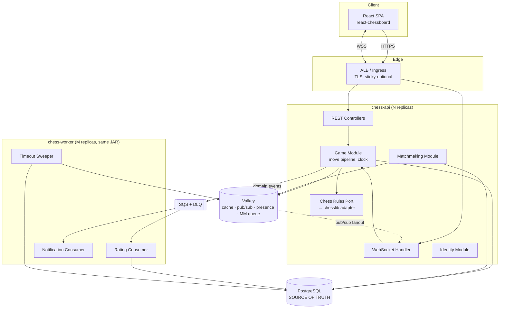
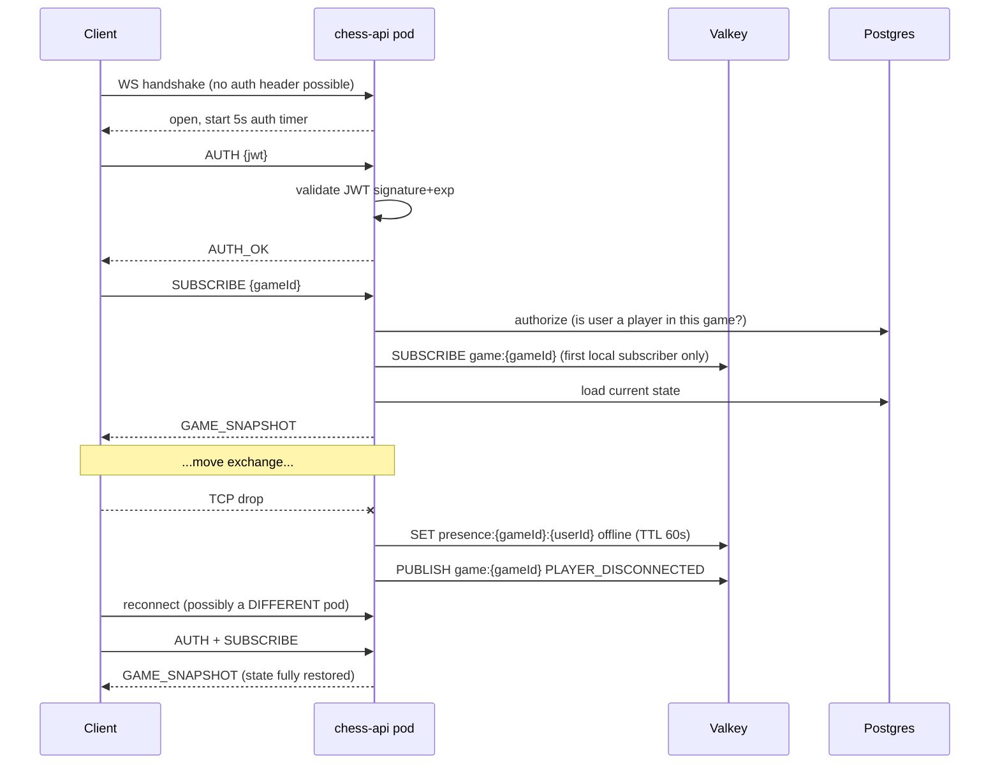

# ARCHITECTURE

Authoritative technical design for the real-time multiplayer chess platform.
Last updated: Phase 0 (2026-09-06).

Companion documents: `ROADMAP.md` (what/when), `PROJECT_STATE.md` (current status),
`docs/adr/` (why). This file describes the target design; ADRs record the reasoning.

---

## 1. Product scope

A web platform where two authenticated players are matched, play a rated chess game
in real time under a server-authoritative clock, and have the result durably persisted.

**In scope (P0):** auth, profiles, game lifecycle, legal-move validation, real-time
move delivery, server-authoritative clock, reconnection, persistence, concurrency
control, idempotency, Docker, AWS deployment, tests, logs + metrics, documentation.

**In scope (P1):** Valkey caching + presence, matchmaking, Elo ratings, SQS async
processing, CI/CD, Kubernetes, load testing, tracing, rate limiting.

**Explicitly out of scope:** tournaments, spectators, engine analysis, chat, mobile
apps, multi-region, service mesh, Kafka. See `ROADMAP.md` § Scope Priority.

---

## 2. Non-functional requirements

These are *targets*, not measurements. Nothing here is claimed until `docs/perf/`
contains a k6 report backing it.

| Concern | Target |
|---|---|
| Move round-trip (client → server → opponent), p95 | < 150 ms intra-region |
| REST API p95 | < 200 ms |
| Concurrent WebSocket connections (measured target) | 1,000 |
| Concurrent active games (measured target) | 300 |
| Clock accuracy | ±50 ms of true elapsed, independent of client |
| Data durability | Zero lost completed games; move log is append-only |
| Recovery | Any pod may be killed mid-game with no game-state loss |
| Availability model | Single-AZ acceptable for portfolio; multi-AZ discussed only |

---

## 3. System architecture

### 3.1 Shape: modular monolith → selective extraction

One Spring Boot deployable containing all modules. Async workers run from the **same
artifact** under a different Spring profile, so they can be scaled independently on
ECS/Kubernetes without becoming a separate codebase. See ADR-001.



### 3.2 Module responsibilities

| Module | Owns | Exposes | Never does |
|---|---|---|---|
| `identity` | users, credentials, tokens | `UserId` lookup, auth filter | game logic |
| `chess` | rules port + chesslib adapter | `ChessRules` interface | I/O, persistence |
| `game` | game lifecycle, move pipeline, clock | `GameService`, read models | HTTP concerns |
| `realtime` | WS sessions, protocol, fanout | session registry | business rules |
| `matchmaking` | queue, pairing | `MatchmakingService` | game mutation (calls `game`) |
| `rating` | Elo, rating history | consumer beans | synchronous calls from `game` |
| `platform` | security config, observability, errors | cross-cutting beans | domain logic |

Boundaries are enforced by **ArchUnit tests**, not convention. A module may only be
reached through its top-level package; `..internal..` packages are unreachable
cross-module. This is a ~1-hour investment that makes the "modular monolith" claim
defensible instead of aspirational.

---

## 4. Data architecture

### 4.1 Source of truth

**PostgreSQL is the only source of truth. Valkey holds nothing that cannot be
rebuilt from PostgreSQL.** See ADR-004.

A second, stronger property: `games.fen` is a *denormalisation* of the `moves` table.
The entire current position of every game is recomputable by replaying its move log.
This means we can survive not just cache loss but corruption of the position column.

### 4.2 Core schema (Phase 1–3)

```sql
-- Flyway V1
CREATE TABLE users (
    id              UUID PRIMARY KEY,
    username        VARCHAR(32)  NOT NULL,
    email           VARCHAR(255) NOT NULL,
    password_hash   VARCHAR(100) NOT NULL,   -- bcrypt, includes salt+cost
    rating          INTEGER      NOT NULL DEFAULT 1200,
    created_at      TIMESTAMPTZ  NOT NULL DEFAULT now(),
    CONSTRAINT uq_users_username UNIQUE (username),
    CONSTRAINT uq_users_email    UNIQUE (email)
);
CREATE INDEX idx_users_rating ON users (rating);

CREATE TABLE games (
    id                UUID PRIMARY KEY,
    white_player_id   UUID NOT NULL REFERENCES users(id),
    black_player_id   UUID NOT NULL REFERENCES users(id),
    status            VARCHAR(16) NOT NULL,   -- ACTIVE|FINISHED|ABORTED
    result            VARCHAR(16),            -- WHITE_WIN|BLACK_WIN|DRAW|NULL
    termination       VARCHAR(24),            -- CHECKMATE|TIMEOUT|RESIGNATION|
                                              -- STALEMATE|DRAW_50|DRAW_REPETITION|
                                              -- DRAW_INSUFFICIENT|ABANDONED
    fen               VARCHAR(100) NOT NULL,  -- derived; rebuildable from moves
    ply               INTEGER      NOT NULL DEFAULT 0,
    side_to_move      CHAR(1)      NOT NULL,  -- 'w' | 'b'
    -- clock (see §6)
    initial_ms        INTEGER      NOT NULL,
    increment_ms      INTEGER      NOT NULL,
    white_ms_left     INTEGER      NOT NULL,
    black_ms_left     INTEGER      NOT NULL,
    last_move_at      TIMESTAMPTZ  NOT NULL,
    turn_deadline     TIMESTAMPTZ  NOT NULL,  -- last_move_at + mover's ms_left
    version           BIGINT       NOT NULL DEFAULT 0,  -- JPA @Version
    created_at        TIMESTAMPTZ  NOT NULL DEFAULT now(),
    finished_at       TIMESTAMPTZ,
    CONSTRAINT ck_distinct_players CHECK (white_player_id <> black_player_id)
);
-- Supports the timeout sweeper as a cheap index scan, not a table scan.
CREATE INDEX idx_games_active_deadline ON games (turn_deadline)
    WHERE status = 'ACTIVE';
CREATE INDEX idx_games_white ON games (white_player_id, created_at DESC);
CREATE INDEX idx_games_black ON games (black_player_id, created_at DESC);

CREATE TABLE moves (
    game_id         UUID    NOT NULL REFERENCES games(id) ON DELETE CASCADE,
    ply             INTEGER NOT NULL,
    uci             VARCHAR(6)  NOT NULL,   -- e2e4, e7e8q
    san             VARCHAR(10) NOT NULL,   -- Nf3, exd8=Q+
    fen_after       VARCHAR(100) NOT NULL,
    ms_left_after   INTEGER NOT NULL,       -- mover's clock after this move
    client_move_id  UUID    NOT NULL,       -- idempotency key
    created_at      TIMESTAMPTZ NOT NULL DEFAULT now(),
    PRIMARY KEY (game_id, ply)
);
-- The idempotency guarantee. A retried move cannot be applied twice.
CREATE UNIQUE INDEX uq_moves_client_id ON moves (game_id, client_move_id);
```

**Design notes worth defending:**

- **UUID v7 primary keys, not bigserial.** v7 is time-ordered, so B-tree inserts stay
  at the right edge (avoiding the random-UUID index-fragmentation problem) while still
  being generatable client-side and safe to expose in URLs. Sequential integers would
  leak game/user counts and require a round-trip to allocate.
- **`(game_id, ply)` as the moves PK.** The natural key. Makes "fetch a game's moves in
  order" a single index range scan, and makes double-insertion of a ply structurally
  impossible.
- **`turn_deadline` is stored, not computed.** A generated/derived value can't be
  indexed usefully for the sweeper query. Storing it turns "find every game that has
  flagged" into an index scan on a partial index. This is the difference between the
  sweeper being O(active games) and O(all games ever).
- **`version` column.** Optimistic locking. See §7.

### 4.2.1 Type mapping reference

**Write both sides from this table.** Entity/migration disagreement is invisible until
startup, where `ddl-auto: validate` catches it — by design, but it has now cost two
debugging rounds (`Instant` vs `TIMESTAMPTZ`, then `CHAR` vs `VARCHAR`). One reference
removes the guesswork.

| Java | PostgreSQL | Notes |
|---|---|---|
| `UUID` | `UUID` | |
| `String` + `length = n` | `VARCHAR(n)` | **Never `CHAR(n)`** — stored as blank-padded `bpchar`, no benefit in PG, and Hibernate expects `varchar` |
| `String` unbounded | `TEXT` | |
| `int` / `Integer` | `INTEGER` | |
| `long` / `Long` | `BIGINT` | `@Version` columns |
| `boolean` | `BOOLEAN` | |
| `Instant` | `TIMESTAMPTZ` | requires `hibernate.type.preferred_instant_jdbc_type: TIMESTAMP_UTC` |
| `BigDecimal` | `NUMERIC(p,s)` | never `float`/`double` for anything counted |
| enum + `@Enumerated(STRING)` | `VARCHAR(n)` | with a `CHECK` constraint listing the values |

One entity's mismatch fails the **entire** persistence unit, so a new entity breaks every
existing test too. That is why a single wrong column type produced 25 failures across two
unrelated test classes.

### 4.3 Access patterns

| Query | Frequency | Path |
|---|---|---|
| Load game for move validation | every move | PK lookup |
| Insert move + update game | every move | single tx |
| Sweep timed-out games | 1/sec per sweeper | partial index scan |
| Game history for a user | rare | `idx_games_white/black`, keyset paginated |
| Leaderboard | rare, cached | `idx_users_rating` |

Pagination is **keyset (`WHERE created_at < :cursor`)**, not `OFFSET`. Offset
pagination degrades linearly and produces duplicates when rows are inserted during
paging. Keyset is not harder to write and is the correct default.

---

## 5. Real-time architecture

### 5.1 Transport

Raw WebSocket (`org.springframework.web.socket.WebSocketHandler`) with a custom JSON
envelope. **Not STOMP.** See ADR-003 — the short version is that Spring's simple STOMP
broker does not fan out across instances, and fixing that means adding RabbitMQ purely
as a relay. Designing the protocol ourselves is also where most of the interview value
in this project lives.

### 5.2 Envelope

Every frame, both directions:

```json
{ "v": 1, "type": "MOVE_MADE", "seq": 42, "ts": "2026-09-06T10:12:03.221Z", "payload": {} }
```

**Server → client types**

| Type | Payload | When |
|---|---|---|
| `AUTH_OK` / `AUTH_FAILED` | `{userId}` / `{reason}` | after first-message auth |
| `GAME_SNAPSHOT` | full state (fen, clocks, ply, players, lastMove) | on subscribe/resume |
| `GAME_STARTED` | `{gameId, white, black, timeControl}` | pairing complete |
| `MOVE_MADE` | `{ply, uci, san, fenAfter, clocks, deadline}` | move committed |
| `CLOCK_UPDATED` | `{clocks, deadline}` | resync, low-frequency |
| `PLAYER_DISCONNECTED` / `PLAYER_RECONNECTED` | `{userId}` | presence change |
| `GAME_FINISHED` | `{result, termination, ratingDelta}` | terminal |
| `GAME_ABORTED` | `{reason}` | pre-move abandonment |
| `ERROR` | `{code, message, clientMoveId?}` | rejected command |

**Client → server types**

| Type | Payload |
|---|---|
| `AUTH` | `{token}` |
| `SUBSCRIBE` | `{gameId}` |
| `MOVE` | `{gameId, clientMoveId, expectedPly, from, to, promotion?}` |
| `RESIGN` | `{gameId}` |
| `PING` | `{}` |

The `MOVE` command carries three fields the naive `"move e2e4"` string cannot:

- `clientMoveId` (UUID, client-generated) — makes retries idempotent. Without it a
  dropped ACK forces the client to choose between losing the move and playing it twice.
- `expectedPly` — optimistic concurrency at the protocol level. A client whose view is
  stale (it missed the opponent's move) submits the wrong ply and is rejected with a
  resync instead of silently playing into a position it doesn't see.
- structured `from`/`to`/`promotion` — no ambiguity, no SAN parsing on the server,
  promotion is explicit rather than inferred.

### 5.3 Connection lifecycle



**Authentication happens in the first message, not the handshake.** Browsers cannot
set arbitrary headers on a WebSocket handshake. The alternatives are a token in the
query string (leaks into access logs, proxy logs, and browser history) or a cookie
(re-introduces CSRF surface). First-message auth costs a 5-second timer and a cap on
unauthenticated sockets, and leaks nothing. See ADR-009.

### 5.4 Cross-instance fanout

With N API pods behind an ALB, the two players in a game are frequently connected to
different pods. Pod A commits White's move; Black's socket lives on pod B.

Valkey Pub/Sub, one channel per game (`game:{gameId}`). A pod subscribes to a channel
only while it holds at least one local socket for that game, and unsubscribes when the
last one leaves. Publish happens **after** the database transaction commits, never
inside it — publishing inside the transaction would broadcast a move that a subsequent
rollback erases.

Pub/Sub is fire-and-forget with no delivery guarantee. That is acceptable **because of
§5.3**: any client that misses a message and reconnects receives a full snapshot, which
repairs any divergence. Choosing a durable transport (Redis Streams) here would add
consumer-group management and trimming for a guarantee we already get more cheaply from
snapshot-on-reconnect. See ADR-007.

**No sticky sessions required.** Any pod can serve any player at any time because no
game state lives in pod memory. This is a deliberate property, and it is what makes
rolling deployments and HPA safe later.

---

## 6. The clock

The single most interesting distributed-systems problem in this project.

### 6.1 The naive design and why it fails

Naive: a `ScheduledExecutorService` per active game, ticking down an in-memory counter,
firing a timeout when it hits zero.

Failure modes: (1) the counter dies with the pod; (2) two pods can both hold a timer for
the same game after a rebalance and double-fire the timeout; (3) N thousand games means
N thousand timers; (4) GC pauses and thread-pool saturation make the tick interval a
lie; (5) it cannot be restored on restart.

### 6.2 The design: the clock does not tick

The server stores `(white_ms_left, black_ms_left, last_move_at, side_to_move)`.
Remaining time is **derived on read**, never counted:

```
remaining(side_to_move) = stored_ms_left − (now − last_move_at)
remaining(other side)   = stored_ms_left                     // frozen
```

On a move by the side to move, inside one transaction:

```
elapsed          = now() − last_move_at
new_ms_left      = stored_ms_left − elapsed + increment_ms
if (stored_ms_left − elapsed) <= 0  → flag fall, game ends on time
last_move_at     = now()
side_to_move     = other
turn_deadline    = now() + other_side_ms_left
```

No timers. No in-memory state. No per-game threads. The clock is a pure function of
three persisted columns and the current time, so it survives pod death, reconnection to
a different pod, and full cluster restart identically.

**`now()` comes from PostgreSQL, not from the application server.** Two pods on
different hosts have clocks that differ by tens of milliseconds even under NTP; using
`System.currentTimeMillis()` means the same game's elapsed time is measured against
different clocks on successive moves, and the error accumulates and can go *negative*.
Taking the timestamp from the database makes one machine the sole time authority for
every game. This costs nothing and removes an entire class of bug.

### 6.3 Detecting flag-fall when nobody moves

If a player simply stops playing, no request arrives to trigger the check. Two layers:

1. **Lazy:** any read or move attempt evaluates the deadline. Covers the common case
   where the opponent is watching and will act.
2. **Active sweeper:** a scheduled job queries
   `SELECT id FROM games WHERE status='ACTIVE' AND turn_deadline < now() FOR UPDATE SKIP LOCKED LIMIT 100`
   and finalises each. `SKIP LOCKED` means multiple sweeper replicas can run
   concurrently and never contend or double-finalise — the database does the
   coordination, so no distributed lock is needed.

The partial index `idx_games_active_deadline` makes this an index scan bounded by the
number of *expired* games, not the number of games.

### 6.4 Latency policy

Elapsed time is measured from `last_move_at` to server receipt, so network latency is
charged to the moving player. This is what we do, and we document it. Lichess-style
lag compensation (crediting back a measured RTT, capped) is a real refinement and is
**explicitly out of scope** — it requires per-connection RTT measurement and opens an
abuse vector where a client fakes latency.

---

## 7. Concurrency strategy

### 7.1 What is actually being protected

The invariant: **for a given `(game_id, ply)`, exactly one move is ever committed.**

Threats: both players submitting simultaneously; a client retrying after a timeout; two
pods handling the same game; a malicious client spamming moves; the sweeper finalising
a game at the same instant a move lands.

### 7.2 Mechanism: three overlapping layers, no distributed lock

**Layer 1 — Idempotency (`uq_moves_client_id`).** A retried `MOVE` with the same
`clientMoveId` violates the unique constraint. We catch it and return the *original*
result rather than an error. The client cannot tell a retry from a first attempt, which
is the definition of idempotent.

**Layer 2 — Optimistic locking (`games.version` / JPA `@Version`).** Two concurrent
transactions both read version 7; both try to write version 8; one commits, the other
gets `OptimisticLockException`. We do **not** blindly retry — we re-read and re-validate.
In chess, the loser of the race is almost always making an illegal move anyway (it is
now the opponent's turn), so the retry correctly fails with `NOT_YOUR_TURN`.

**Layer 3 — Structural (`PRIMARY KEY (game_id, ply)`).** Even if both other layers were
buggy, the database physically cannot store two moves at the same ply.

### 7.3 Why not a Redis distributed lock

Because the database already provides the guarantee, and Redlock would *add* failure
modes without removing the need for the constraint.

A Redis lock has a TTL. If the holder experiences a 3-second GC pause while holding a
2-second lock, the lock expires, a second process acquires it, and now two processes
believe they hold it. The standard mitigation is a fencing token checked at the
storage layer — at which point you have re-invented optimistic locking, and you still
need the database check. So the lock buys nothing here.

Concretely: contention on a single chess game is *two* actors alternating turns. This
is the lowest-contention scenario imaginable. Optimistic locking is designed exactly
for it.

**Where a lock would be justified:** a long critical section spanning multiple systems
that cannot be wrapped in one transaction. We don't have one. If matchmaking needed
cross-system atomicity we would reach for it — but §8 shows a Lua script solves that
atomically without a lock.

### 7.4 Transaction boundary

One transaction per move, containing: load game → validate → apply rules → insert move
→ update game. The chess computation happens *inside* the transaction but takes
microseconds. Pub/Sub publish and SQS send happen **after commit** (via
`TransactionSynchronization` / `@TransactionalEventListener(AFTER_COMMIT)`).

---

## 8. Matchmaking

Valkey sorted set per time-control: `mm:{timeControl}` scored by rating. Pairing is a
single **Lua script** — Valkey executes it atomically, so "find two compatible players
and remove both" cannot interleave with another worker doing the same thing. That is
atomicity without a lock.

Window expansion: entry stores `enqueued_at`; acceptable rating delta grows as
`base + k * waited_seconds`, capped. Prevents a 2400-rated player waiting forever.

Stale entries: TTL on a companion `mm:entry:{userId}` key; the script validates the
companion key exists before pairing, so a crashed client's ZSET entry is skipped and
lazily removed.

Duplicate enqueue: `mm:entry:{userId}` is set with `NX`; a second enqueue is a no-op.

**Scale discussion (theoretical, not built):** at 10 players a single worker and a
single ZSET is correct. At 10,000, one ZSET is still fine (`ZRANGEBYSCORE` is
O(log N + M)) but you want several workers, which the Lua atomicity already supports.
At 1M concurrent seekers you shard by rating band across Valkey nodes and accept
cross-band pairing degradation, or move to a dedicated matchmaking service with an
in-memory index and a durable log. We build the first, discuss the rest.

---

## 9. Messaging

**SQS Standard + idempotent consumers. Not Kafka. Not SQS FIFO.** See ADR-008.

Events: `GameFinished` → rating update; `GameFinished` → notification. That's it
initially. Producers write the event **after** the game transaction commits.

We deliberately choose *at-least-once* Standard delivery over FIFO's exactly-once
semantics, because handling duplicate delivery correctly is the skill worth
demonstrating, and FIFO would hide it behind a managed guarantee that doesn't exist in
most real systems.

Consumer idempotency: a `processed_events (event_id PRIMARY KEY, processed_at)` table.
The consumer inserts the event id in the same transaction as its side effect; a
duplicate hits the PK constraint and is acknowledged without re-applying. Rating
updates are not naturally idempotent (`rating += delta` applied twice is wrong), which
is precisely why this table exists.

Retries and DLQ: SQS redrive policy, `maxReceiveCount: 3`, then DLQ. A CloudWatch alarm
on DLQ depth > 0. Poison messages must be visible, not silently dropped.

Kafka would be justified by: event replay for rebuilding read models, many independent
consumer groups over one ordered stream, or sustained high-throughput stream processing.
We have none of these, and Kafka's operational cost (or MSK's ~$150+/month) is real.

---

## 10. Security

| Concern | Decision |
|---|---|
| Passwords | bcrypt via Spring Security `DelegatingPasswordEncoder`, cost 12 |
| Access token | JWT, HS256 (single service), 15-min TTL, `sub`+`jti`+`ver` |
| Refresh token | Opaque random 256-bit, hashed at rest, rotating, httpOnly SameSite=Strict cookie |
| Why JWT | Stateless verification lets any pod authenticate a WebSocket without a shared session store or sticky sessions — the same property that makes §5.4 work |
| WS auth | First message (§5.3), 5s timeout, unauthenticated-socket cap |
| WS authz | Every `SUBSCRIBE` re-checks that the user is a player in that game |
| Rate limiting | Bucket4j backed by Valkey: 5/min on login, 20/s on moves per user |
| Transport | TLS terminated at ALB; WSS only in production |
| Secrets | AWS Secrets Manager (RDS creds) + SSM Parameter Store (config); never in env files committed to git |
| SQLi | Parameterised queries via JPA/JDBC only; zero string-concatenated SQL |
| XSS | React escapes by default; no `dangerouslySetInnerHTML`; strict CSP header |
| CSRF | Not applicable to the JWT-in-header API; applicable to the refresh cookie endpoint, which uses SameSite=Strict + a double-submit token |
| Headers | HSTS, X-Content-Type-Options, X-Frame-Options: DENY, CSP |
| IAM | Task role per service, least privilege: worker gets `sqs:ReceiveMessage`+`DeleteMessage` on one queue, nothing more |

### What the client is never authoritative about

Whose turn it is · whether a move is legal · the resulting position · remaining clock
time · the game result · rating changes · matchmaking outcome.

The client is authoritative only about *its intent*: which square it wants to move
from and to. Everything else is computed server-side and pushed down. The React app
maintains a local board only for rendering, and a `GAME_SNAPSHOT` overwrites it
unconditionally.

---

## 11. Observability

**Cross-cutting from Phase 1, not a phase-9 bolt-on.** The spec's own phase plan puts
observability at week 13+ while the week-12 portfolio deadline requires it; the
resolution is to build logging and metrics from the first commit and reserve Phase 9
for tracing, dashboards, and load-test-driven optimisation.

**Logs:** JSON via `logstash-logback-encoder`. MDC populated by a servlet filter and a
WebSocket interceptor with `requestId`, `userId`, `gameId`, `instanceId`.

**Metrics** (Micrometer → `/actuator/prometheus`):

| Metric | Type | Why it matters |
|---|---|---|
| `chess_move_processing_seconds` | timer | the core latency SLO |
| `chess_move_conflicts_total` | counter | optimistic-lock failures — proves §7 fires |
| `chess_move_idempotent_replays_total` | counter | proves retry handling works |
| `chess_ws_connections_active` | gauge | capacity planning input |
| `chess_ws_reconnects_total` | counter | connection stability |
| `chess_games_active` | gauge | load |
| `chess_matchmaking_wait_seconds` | histogram | product quality |
| `chess_clock_sweeper_finalized_total` | counter | proves §6.3 fires |
| `sqs_consumer_lag` / DLQ depth | gauge | async health |

`chess_move_conflicts_total` is the metric to point at in an interview: it is direct
evidence that the concurrency design is exercised rather than theoretical.

**Tracing:** OpenTelemetry Java agent, OTLP. The interesting span is the async hop —
trace context is injected into SQS **message attributes** so a trace spans
`API → game tx → SQS → rating worker → DB`. Without manual propagation the trace breaks
at the queue boundary, which is the most common tracing mistake in event-driven systems.

---

## 12. Deployment architecture

### 12.1 Two paths, deliberately

| Path | What | Cost | When |
|---|---|---|---|
| **A — always-on demo** | single t3.small EC2 + Docker Compose + containerised Postgres/Valkey | ~$15/mo | live URL for recruiters, 24/7 |
| **B — production reference** | Terraform: VPC, ALB, ECS Fargate, RDS, ElastiCache, SQS, ECR, Secrets Manager | ~$60–80/mo if left running | applied for demos/load tests, then destroyed |
| **C — Kubernetes** | kind locally (full manifests); EKS in a time-boxed 2–3 day window | ~$0 / ~$20 for the window | Phase 8 |

Path B is never left running. `terraform apply` → measure → screenshot → `terraform
destroy`. The Terraform code, the load-test reports, and a recorded demo are the
artifacts; a permanently-running ECS cluster is not. See ADR-010.

**All AWS figures in this document are estimates from published us-east-1 on-demand
pricing and are not billing observations.** Total project AWS budget target: **< $50.**

**NAT Gateway is the trap.** At ~$0.045/hr plus data processing it is ~$32/month —
more than the compute. Avoided by placing Fargate tasks in public subnets with
restrictive security groups (no inbound except from the ALB SG) and using VPC gateway
endpoints for S3. This is a legitimate architecture for this workload and a good
cost-engineering answer.

### 12.2 Kubernetes

Manifests demonstrate: Deployment, Service, Ingress, ConfigMap, Secret, readiness vs
liveness probes (different endpoints — readiness checks dependencies, liveness checks
only that the JVM is alive), resource requests/limits, HPA on CPU + a custom metric,
`RollingUpdate` with `maxUnavailable: 0`, PodDisruptionBudget, and
`terminationGracePeriodSeconds` tuned to Spring's graceful shutdown.

**The interesting Kubernetes problem here is graceful shutdown of a WebSocket server.**
On SIGTERM a pod must: fail readiness immediately (so the Ingress stops sending new
connections), send a `GOING_AWAY` close frame with a reconnect hint to every open
socket, drain in-flight move transactions, then exit. Without this, a rolling deploy
severs live games. With it, clients reconnect to a surviving pod and receive a snapshot
(§5.3) — the game is uninterrupted. This is the payoff for keeping zero game state in
pod memory.

---

## 13. Failure matrix

| Failure | Behaviour | Degradation |
|---|---|---|
| PostgreSQL down | Moves rejected with 503; existing sockets stay open; no data loss | Hard — game pauses. Clocks are wall-clock derived so they keep running; on recovery a player may have flagged. **Accepted, documented.** |
| Valkey down | Moves still commit (DB path unaffected). Fanout stops. | Soft — clients fall back to polling `GET /games/{id}` on backoff. Matchmaking unavailable. Presence unavailable. |
| SQS down | Game plays and finishes normally; rating updates queue in an outbox table | Soft — ratings lag, then catch up |
| API pod crashes | Sockets drop; clients reconnect to another pod; snapshot restores state | Near-zero — a reconnect blip |
| Whole AZ fails | RDS Multi-AZ failover (~60–120s) if enabled; otherwise outage | Documented; Multi-AZ is Optional (cost) |
| Client disconnects | Presence flips; clock keeps running (correct — chess does not pause for disconnects) | None |
| Duplicate move | `uq_moves_client_id` → original result replayed | None |
| Duplicate SQS delivery | `processed_events` PK → acknowledged, not re-applied | None |
| Rating consumer fails 3× | Message → DLQ, alarm fires; game result unaffected | Soft |
| Deploy during live game | Graceful shutdown → close frame → reconnect → snapshot | Near-zero |
| Both players abandon | Sweeper flags on time; abandoned pre-move games aborted after 30s | None |

The row worth being honest about is **PostgreSQL down**: this architecture has a hard
dependency on it and there is no graceful path. Pretending otherwise would be worse
than documenting it.

---

## 14. Scalability

Measured target: **1,000 concurrent WebSocket connections / 300 active games.**
Everything below that line is theoretical and labelled as such.

**Where the first bottleneck actually is:** not CPU, and not WebSocket connections
(a JVM handles tens of thousands of idle sockets on modest memory). It is the
**database connection pool**. Every move is a short write transaction; with a HikariCP
pool of 10 per pod and a 5ms transaction, one pod ceilings around 2,000 moves/sec —
but RDS `db.t4g.micro` allows ~85 total connections, so pods × pool size is the real
constraint. This is the number to measure in Phase 9.

| Scale | What changes |
|---|---|
| 1K conn | Current design. 2 pods. Measured. |
| 10K conn | More pods; connection pooling via PgBouncer; move Valkey to a larger node; batch clock sweeps. *Theoretical.* |
| 100K conn | Separate WebSocket gateway tier from the game service; game state in Valkey with write-behind to Postgres; read replicas for history/leaderboard. *Theoretical.* |
| 1M+ conn | Shard games by `gameId` hash across independent cells; per-cell Postgres and Valkey; a routing layer maps a game to its cell; cross-cell traffic is zero because a chess game is a perfectly-shardable unit. *Theoretical.* |

Chess is unusually shard-friendly: a game involves exactly two players and no
cross-game consistency requirement. That is why the 1M answer is "cells", not
"distributed transactions".

---

## 15. Testing strategy

| Layer | Tool | What |
|---|---|---|
| Unit | JUnit 5 + AssertJ | rules adapter, `ClockCalculator` (pure function), Elo |
| Architecture | ArchUnit | module boundary enforcement (§3.2) |
| Integration | Testcontainers: Postgres 16 + Valkey 8 | repositories, move pipeline, migrations |
| API | MockMvc / RestAssured | authn, authz, validation, status codes |
| **Concurrency** | JUnit + `CountDownLatch` + real Postgres | N threads submit the same ply → assert exactly 1 commit, N−1 rejections, and that `chess_move_conflicts_total` incremented |
| WebSocket | Spring `StandardWebSocketClient`, 2 clients | full game, out-of-order, reconnect mid-game, snapshot correctness |
| Async | Testcontainers LocalStack | SQS produce/consume, duplicate delivery, DLQ routing |
| Load | k6 (`k6/experimental/websockets`) | 1,000 connections, sustained move rate, p95 latency |

k6 over Gatling/JMeter: native WebSocket support, scenarios in JavaScript (no Scala or
XML), single static binary that runs identically in CI and locally, and thresholds that
fail the build. Gatling's WebSocket support is good but the Scala DSL is a tax; JMeter's
WebSocket support requires a third-party plugin.

The **concurrency test is the flagship**. It is the one test that proves the central
claim of this project rather than asserting it.

---

## 16. Open engineering risks

| Risk | Impact | Mitigation |
|---|---|---|
| Phases 7+8 (AWS+K8s, 30–40h) overrun | Blows the budget | Path A/B/C split (§12.1); K8s on kind first; EKS time-boxed |
| Frontend creep | Backend time lost | Hard cap 10h total; `react-chessboard`, no custom renderer |
| Learning time not in the budget | ~40% under-estimate | Explicit "Must understand" section per phase in `ROADMAP.md` |
| chesslib edge cases (threefold, insufficient material) | Correctness bugs | Perft tests against known node counts at depth 1–4 |
| Load-test client is the bottleneck, not the server | Meaningless numbers | Run k6 on a separate EC2 instance; verify client CPU headroom |
| AWS bill surprise | Real money | Budget alarm at $20; `terraform destroy` discipline; no NAT Gateway |
