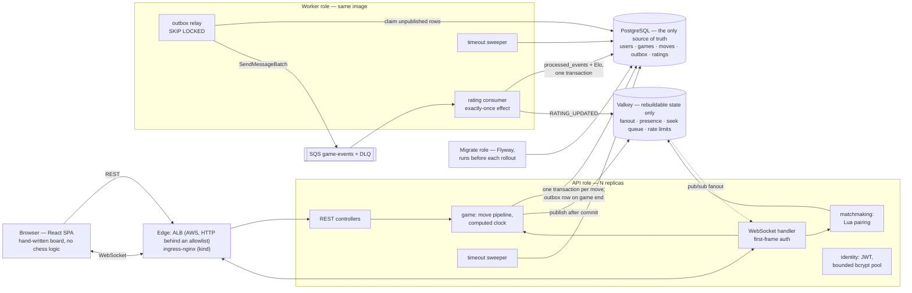
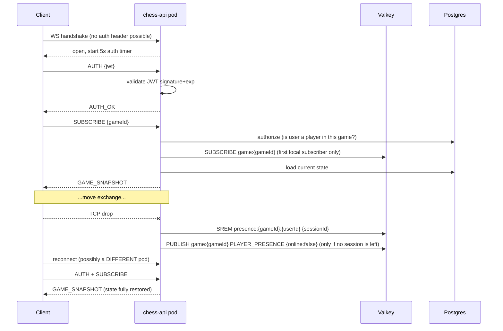

# ARCHITECTURE

Technical design of the real-time multiplayer chess platform **as built**.
Last checked against the code: Phase 10.3 (2026-10-07) — every statement here was verified
against the code, the configuration or a measurement; anything designed but not built says so.

Companion documents: `ROADMAP.md` (what/when), `PROJECT_STATE.md` (current status),
`docs/adr/` (why), `docs/perf/` and `docs/failure-drills.md` (measurements),
`docs/security-review.md`, `docs/diagrams/`.

---

## 1. Product scope

A web platform where two authenticated players are matched, play a rated chess game
in real time under a server-authoritative clock, and have the result durably persisted.

**In scope (P0):** auth, profiles, game lifecycle, legal-move validation, real-time
move delivery, server-authoritative clock, reconnection, persistence, concurrency
control, idempotency, Docker, AWS deployment, tests, logs + metrics, documentation.

**In scope (P1):** Valkey caching + presence, matchmaking, Elo ratings, SQS async
processing, CI/CD, Kubernetes, load testing, tracing, rate limiting.

**Explicitly out of scope:** tournaments, spectators, engine analysis, chat, mobile
apps, multi-region, service mesh, Kafka. See `ROADMAP.md` § Scope Priority.

---

## 2. Non-functional requirements

Targets set in Phase 0, and what was measured against them. A measurement names its
environment; a blank means not measured.

| Concern | Target | Measured |
|---|---|---|
| Move acknowledgement, p95 | < 150 ms intra-region | kind, 1,000 sockets: client p95 6 ms, server p99 6.7 ms (`docs/perf/baseline.md`). Fargate 2 × 0.5 vCPU, ~50 games during 500 sign-ups: p95 73 ms, p99 120 ms (`optimisation-02.md`) |
| REST API p95 | < 200 ms | Not measured on its own; on Fargate the HTTP mix is dominated by bcrypt sign-ups (p95 0.95 s at ~0.8 sign-ups/s) |
| Concurrent WebSocket connections | 1,000 | **1,000 on kind**, flat latency. **~100 on Fargate** — the larger AWS run was stopped on cost |
| Concurrent active games | 300 | 500 on kind (1,000 sockets) |
| Clock accuracy | ±50 ms of true elapsed, independent of client | Server killed mid-game: the side to move lost 31,769 ms over 31,798 ms of wall time (Δ −29 ms); JVM clock skewed +10 min had no effect (`PROJECT_STATE.md` §12) |
| Data durability | Zero lost completed games; move log is append-only | Every k6 game is verified move-by-move against the server: 0 inconsistent across the baseline, the stress run, a rolling deploy, a SIGKILL, and five failure drills |
| Recovery | Any pod may be killed mid-game with no game-state loss | Drilled: SIGKILL (8.3), rolling deploy (8.3), PostgreSQL crash and freeze, queue and worker outages (10.2) |
| Availability model | Single-AZ acceptable for portfolio; multi-AZ discussed only | As targeted |

---

## 3. System architecture

### 3.1 Shape: modular monolith → selective extraction

One Spring Boot deployable containing all modules. Async workers run from the **same
artifact** under a different Spring profile, so they can be scaled independently on
ECS/Kubernetes without becoming a separate codebase. See ADR-001.


```mermaid
flowchart LR
    B["Browser — React SPA<br/>hand-written board, no chess logic"]
    E["Edge: ALB (AWS, HTTP behind an allowlist)<br/>ingress-nginx (kind)"]

    subgraph API["API role — N replicas"]
        REST[REST controllers]
        WS["WebSocket handler<br/>first-frame auth"]
        GAME["game: move pipeline,<br/>computed clock"]
        MM["matchmaking:<br/>Lua pairing"]
        ID["identity: JWT,<br/>bounded bcrypt pool"]
        SW1[timeout sweeper]
    end

    subgraph WRK["Worker role — same image"]
        RELAY["outbox relay<br/>SKIP LOCKED"]
        RATE["rating consumer<br/>exactly-once effect"]
        SW2[timeout sweeper]
    end

    MIG["Migrate role — Flyway,<br/>runs before each rollout"]

    PG[("PostgreSQL — the only source of truth<br/>users · games · moves · outbox · ratings")]
    VK[("Valkey — rebuildable state only<br/>fanout · presence · seek queue · rate limits")]
    SQS[["SQS game-events + DLQ"]]

    B -->|REST| E
    B <-->|WebSocket| E
    E --> REST
    E <--> WS
    REST --> GAME
    WS --> GAME
    WS --> MM
    GAME -->|"one transaction per move;<br/>outbox row on game end"| PG
    MM --> VK
    GAME -->|publish after commit| VK
    VK -.->|pub/sub fanout| WS
    SW1 --> PG
    SW2 --> PG
    RELAY -->|claim unpublished rows| PG
    RELAY -->|SendMessageBatch| SQS
    SQS --> RATE
    RATE -->|"processed_events + Elo,<br/>one transaction"| PG
    RATE -->|RATING_UPDATED| VK
    MIG --> PG
```

### 3.2 Module responsibilities

| Module | Owns | Exposes | Never does |
|---|---|---|---|
| `identity` | users, credentials, tokens | `IdentityFacade` | game logic |
| `chess` | rules port + chesslib adapter | `ChessRules` | I/O, persistence |
| `game` | game lifecycle, move pipeline, clock, sweeper | `GameFacade`, `GameEvents` | HTTP concerns |
| `realtime` | WebSocket sessions, protocol, fanout, presence | the `/ws` endpoint | business rules |
| `matchmaking` | seek queue, pairing | `MatchmakingFacade` | game mutation (calls `game`) |
| `messaging` | outbox, relay, SQS setup | `Outbox` | business decisions |
| `rating` | Elo, rating history, the consumer | consumer beans | synchronous calls from `game` |
| `common` | error types, IDs, rate limiter, Valkey circuit | shared types | depend on any business module |
| `platform` | security, password hashing, clock, Valkey client config | cross-cutting beans | domain logic |

Boundaries are enforced by **ArchUnit tests**, not convention. A module may only be
reached through its top-level package; `..internal..` packages are unreachable
cross-module; `common` depends on no business module; no cycles. The rules were vacuous —
green while importing zero classes — until 4.1b, when a guard asserting that the importer
sees the codebase was added (ADR-001).

---

## 4. Data architecture

### 4.1 Source of truth

**PostgreSQL is the only source of truth. Valkey holds nothing that cannot be
rebuilt from PostgreSQL.** See ADR-004.

A second, stronger property: `games.fen` is a *denormalisation* of the `moves` table.
The entire current position of every game is recomputable by replaying its move log.
This means we can survive not just cache loss but corruption of the position column.

### 4.2 Core schema (Phase 1–3)

Abridged. **The migrations in `backend/src/main/resources/db/migration` are authoritative**
(V1–V8). Since the Phase 1 sketch below: `side_to_move` became `VARCHAR(5)` `WHITE|BLACK` (V3),
the clock columns and `turn_deadline` arrived in V4–V5, and V2 (refresh tokens), V6 (outbox),
V7 (`processed_events`, `rating_history`) and V8 (`outbox.trace_parent`) added tables.

```sql
-- Flyway V1
CREATE TABLE users (
    id              UUID PRIMARY KEY,
    username        VARCHAR(32)  NOT NULL,
    email           VARCHAR(255) NOT NULL,
    password_hash   VARCHAR(100) NOT NULL,   -- bcrypt, includes salt+cost
    rating          INTEGER      NOT NULL DEFAULT 1200,
    created_at      TIMESTAMPTZ  NOT NULL DEFAULT now(),
    CONSTRAINT uq_users_username UNIQUE (username),
    CONSTRAINT uq_users_email    UNIQUE (email)
);
CREATE INDEX idx_users_rating ON users (rating);

CREATE TABLE games (
    id                UUID PRIMARY KEY,
    white_player_id   UUID NOT NULL REFERENCES users(id),
    black_player_id   UUID NOT NULL REFERENCES users(id),
    status            VARCHAR(16) NOT NULL,   -- ACTIVE|FINISHED|ABORTED
    result            VARCHAR(16),            -- WHITE_WIN|BLACK_WIN|DRAW|NULL
    termination       VARCHAR(24),            -- CHECKMATE|STALEMATE|RESIGNATION|TIMEOUT|
                                              -- DRAW_FIFTY_MOVE|DRAW_REPETITION|
                                              -- DRAW_INSUFFICIENT_MATERIAL|ABANDONED
    fen               VARCHAR(100) NOT NULL,  -- derived; rebuildable from moves
    ply               INTEGER      NOT NULL DEFAULT 0,
    side_to_move      VARCHAR(5)   NOT NULL,  -- WHITE | BLACK (V3; was CHAR(1))
    -- clock (see §6)
    initial_ms        INTEGER      NOT NULL,
    increment_ms      INTEGER      NOT NULL,
    white_ms_left     INTEGER      NOT NULL,
    black_ms_left     INTEGER      NOT NULL,
    last_move_at      TIMESTAMPTZ  NOT NULL,
    turn_deadline     TIMESTAMPTZ  NOT NULL,  -- next instant the game needs attention:
                                              -- mover's flag-fall, or the 30 s first-move
                                              -- window while ply < 2 (§6.5, ADR-014)
    version           BIGINT       NOT NULL DEFAULT 0,  -- JPA @Version
    created_at        TIMESTAMPTZ  NOT NULL DEFAULT now(),
    finished_at       TIMESTAMPTZ,
    CONSTRAINT ck_distinct_players CHECK (white_player_id <> black_player_id)
);
-- Supports the timeout sweeper as a cheap index scan, not a table scan.
CREATE INDEX idx_games_active_deadline ON games (turn_deadline)
    WHERE status = 'ACTIVE';
CREATE INDEX idx_games_white ON games (white_player_id, created_at DESC);
CREATE INDEX idx_games_black ON games (black_player_id, created_at DESC);

CREATE TABLE moves (
    game_id         UUID    NOT NULL REFERENCES games(id) ON DELETE CASCADE,
    ply             INTEGER NOT NULL,
    uci             VARCHAR(6)  NOT NULL,   -- e2e4, e7e8q
    san             VARCHAR(10) NOT NULL,   -- Nf3, exd8=Q+
    fen_after       VARCHAR(100) NOT NULL,
    ms_left_after   INTEGER NOT NULL,       -- mover's clock after this move
    client_move_id  UUID    NOT NULL,       -- idempotency key
    created_at      TIMESTAMPTZ NOT NULL DEFAULT now(),
    PRIMARY KEY (game_id, ply)
);
-- The idempotency guarantee. A retried move cannot be applied twice.
CREATE UNIQUE INDEX uq_moves_client_id ON moves (game_id, client_move_id);
```

**Design notes worth defending:**

- **UUID v7 primary keys, not bigserial.** v7 is time-ordered, so B-tree inserts stay
  at the right edge (avoiding the random-UUID index-fragmentation problem) while still
  being generatable client-side and safe to expose in URLs. Sequential integers would
  leak game/user counts and require a round-trip to allocate.
- **`(game_id, ply)` as the moves PK.** The natural key. Makes "fetch a game's moves in
  order" a single index range scan, and makes double-insertion of a ply structurally
  impossible.
- **`turn_deadline` is stored, not computed.** A generated/derived value can't be
  indexed usefully for the sweeper query. Storing it turns "find every game that has
  flagged" into an index scan on a partial index. This is the difference between the
  sweeper being O(active games) and O(all games ever).
- **`version` column.** Optimistic locking. See §7.

### 4.2.1 Type mapping reference

**Write both sides from this table.** Entity/migration disagreement is invisible until
startup, where `ddl-auto: validate` catches it — by design, but it has now cost two
debugging rounds (`Instant` vs `TIMESTAMPTZ`, then `CHAR` vs `VARCHAR`). One reference
removes the guesswork.

| Java | PostgreSQL | Notes |
|---|---|---|
| `UUID` | `UUID` | |
| `String` + `length = n` | `VARCHAR(n)` | **Never `CHAR(n)`** — stored as blank-padded `bpchar`, no benefit in PG, and Hibernate expects `varchar` |
| `String` unbounded | `TEXT` | |
| `int` / `Integer` | `INTEGER` | |
| `long` / `Long` | `BIGINT` | `@Version` columns |
| `boolean` | `BOOLEAN` | |
| `Instant` | `TIMESTAMPTZ` | requires `hibernate.type.preferred_instant_jdbc_type: TIMESTAMP_UTC` |
| `BigDecimal` | `NUMERIC(p,s)` | never `float`/`double` for anything counted |
| enum + `@Enumerated(STRING)` | `VARCHAR(n)` | with a `CHECK` constraint listing the values |

One entity's mismatch fails the **entire** persistence unit, so a new entity breaks every
existing test too. That is why a single wrong column type produced 25 failures across two
unrelated test classes.

### 4.3 Access patterns

| Query | Frequency | Path |
|---|---|---|
| Load game for move validation | every move | PK lookup |
| Insert move + update game | every move | single tx |
| Sweep timed-out games | 1/sec per sweeper | partial index scan |
| Game history for a user | rare | `idx_games_white/black`, offset-paginated, page size clamped to 50 |

There is no leaderboard (`idx_users_rating` exists for one).

**Pagination is offset, deliberately, for this one list.** Keyset (`WHERE created_at <
:cursor`) is the right default for a feed that grows while it is read — offset degrades
linearly and duplicates rows inserted during paging. "My games" is not that: nobody pages past
the first few, and keyset would need a compound `(created_at, id)` cursor for a gain nobody
would see (`GameRepository.findByPlayer`).

---

## 5. Real-time architecture

### 5.1 Transport

Raw WebSocket (`org.springframework.web.socket.WebSocketHandler`) with a custom JSON
envelope. **Not STOMP.** See ADR-003 — the short version is that Spring's simple STOMP
broker does not fan out across instances, and fixing that means adding RabbitMQ purely
as a relay. Designing the protocol ourselves is also where most of the interview value
in this project lives.

### 5.2 Envelope

Every frame, both directions:

```json
{ "v": 1, "type": "MOVE_MADE", "ts": "2026-09-14T10:12:03.221Z", "payload": {} }
```

> **Revised 2026-09-14 (Milestone 2.1): `seq` was specified here and then dropped.**
> Ordering within a connection is already guaranteed by TCP, so a sequence number only
> helps a client detect that it *missed* something — and `ply` already does that,
> monotonically and meaningfully. A separate counter would additionally need to be shared
> across instances once fanout moves to Valkey, putting a distributed counter on the hot
> path to duplicate information the payload already carries. The design got simpler on
> contact with implementation; recorded rather than quietly changed.

**Server → client types**

As implemented (Milestone 3.2). The Phase 0 design listed three more types; what became of
each is recorded below the table rather than silently dropped.

| Type | Payload | When |
|---|---|---|
| `AUTH_OK` / `AUTH_FAILED` | `{userId, username}` / `{code, message}` | after first-message auth |
| `GAME_SNAPSHOT` | full state: fen, ply, sideToMove, players, yourSide, opponentOnline, status, result, termination, legalMoves, lastMoveUci, whiteMsLeft, blackMsLeft, incrementMs, moves (SAN, since 3.3) | on subscribe/resume, and on re-`SUBSCRIBE` after a `CONFLICT` |
| `MOVE_MADE` | `{gameId, ply, uci, san, fenAfter, sideToMove, legalMoves, whiteMsLeft, blackMsLeft}` | move committed |
| `PLAYER_PRESENCE` | `{gameId, userId, online}` | presence change |
| `GAME_FINISHED` | `{gameId, status, result, termination}` — `status` FINISHED or ABORTED; `result` null when ABORTED | terminal, by any route |
| `ERROR` | `{code, message}` | rejected command |
| `PONG` | — | reply to `PING` |
| `SEEK_STATUS` | `{status, initialSeconds?, incrementSeconds?}` — QUEUED \| PAIRING \| CANCELLED \| NOT_SEEKING | reply to `SEEK` / `CANCEL_SEEK` (4.1b) |
| `MATCH_FOUND` | `{gameId, yourSide, initialSeconds, incrementSeconds}` | pushed on pairing; in reply to a seek that finds a match; after `AUTH_OK` if unseen (4.1b, ADR-016) |
| `RATING_UPDATED` | `{gameId, rating, delta}` | after the rating worker commits, via the user channel (5.3); never for a duplicate delivery |

Revisions from the Phase 0 design:

- **`GAME_ABORTED` → folded into `GAME_FINISHED` with `status: ABORTED`** (3.2). One terminal
  message means a client has one place to stop the clock and disable the board. A second
  type would be a second place to forget.
- **`CLOCK_UPDATED` → not needed.** Clocks travel on `MOVE_MADE` and `GAME_SNAPSHOT`, and the
  client extrapolates between them (§6.6). A periodic resync would be traffic proportional
  to games × time for a value both ends can already compute.
- **`PLAYER_DISCONNECTED` / `PLAYER_RECONNECTED` → `PLAYER_PRESENCE {online}`** (2.2).
- **`GAME_STARTED` → `MATCH_FOUND`** (4.1b). Addressed to a player, not a game; direct challenges still return the game from REST.
- **`ratingDelta` on `GAME_FINISHED` → a separate `RATING_UPDATED`** (5.3). Ratings are applied asynchronously, so the result is known before the rating; one message per fact.

**Client → server types**

| Type | Payload |
|---|---|
| `AUTH` | `{token}` |
| `SUBSCRIBE` | `{gameId}` |
| `MOVE` | `{gameId, clientMoveId, expectedPly, from, to, promotion?}` |
| `RESIGN` | `{gameId}` |
| `SEEK` | `{initialSeconds, incrementSeconds}` — idempotent; the client repeats it every 15 s as the seek's heartbeat |
| `CANCEL_SEEK` | `{}` |
| `PING` | `{}` |

The `MOVE` command carries three fields the naive `"move e2e4"` string cannot:

- `clientMoveId` (UUID, client-generated) — makes retries idempotent. Without it a
  dropped ACK forces the client to choose between losing the move and playing it twice.
- `expectedPly` — optimistic concurrency at the protocol level. A client whose view is
  stale (it missed the opponent's move) submits the wrong ply and is rejected with a
  resync instead of silently playing into a position it doesn't see.
- structured `from`/`to`/`promotion` — no ambiguity, no SAN parsing on the server,
  promotion is explicit rather than inferred.

### 5.3 Connection lifecycle


```mermaid
sequenceDiagram
    participant C as Client
    participant W as chess-api pod
    participant V as Valkey
    participant P as Postgres

    C->>W: WS handshake (no auth header possible)
    W-->>C: open, start 5s auth timer
    C->>W: AUTH {jwt}
    W->>W: validate JWT signature+exp
    W-->>C: AUTH_OK
    C->>W: SUBSCRIBE {gameId}
    W->>P: authorize (is user a player in this game?)
    W->>V: SUBSCRIBE game:{gameId}  (first local subscriber only)
    W->>P: load current state
    W-->>C: GAME_SNAPSHOT
    Note over C,W: ...move exchange...
    C--xW: TCP drop
    W->>V: SREM presence:{gameId}:{userId} {sessionId}
    W->>V: PUBLISH game:{gameId} PLAYER_PRESENCE {online:false} (only if no session is left)
    C->>W: reconnect (possibly a DIFFERENT pod)
    C->>W: AUTH + SUBSCRIBE
    W-->>C: GAME_SNAPSHOT (state fully restored)
```

Presence is a set of session IDs per player per game, with a 90 s TTL refreshed by every
`PING`: a player is offline only when their last session leaves, so a reconnect that lands
before the old socket closes announces nothing.

**Authentication happens in the first message, not the handshake.** Browsers cannot
set arbitrary headers on a WebSocket handshake. The alternatives are a token in the
query string (leaks into access logs, proxy logs, and browser history) or a cookie
(re-introduces CSRF surface). First-message auth costs a 5-second timer and a cap on
unauthenticated sockets, and leaks nothing. See ADR-009.

### 5.4 Cross-instance fanout

With N API pods behind an ALB, the two players in a game are frequently connected to
different pods. Pod A commits White's move; Black's socket lives on pod B.

Valkey Pub/Sub, one channel per game (`game:{gameId}`). A pod subscribes to a channel
only while it holds at least one local socket for that game, and unsubscribes when the
last one leaves. Publish happens **after** the database transaction commits, never
inside it — publishing inside the transaction would broadcast a move that a subsequent
rollback erases.

Pub/Sub is fire-and-forget with no delivery guarantee. That is acceptable **because of
§5.3**: any client that misses a message and reconnects receives a full snapshot, which
repairs any divergence. Choosing a durable transport (Redis Streams) here would add
consumer-group management and trimming for a guarantee we already get more cheaply from
snapshot-on-reconnect. See ADR-007.

**No sticky sessions required.** Any pod can serve any player at any time because no
game state lives in pod memory. This is a deliberate property, and it is what makes
rolling deployments and HPA safe later.

---

## 6. The clock

The single most interesting distributed-systems problem in this project.

### 6.1 The naive design and why it fails

Naive: a `ScheduledExecutorService` per active game, ticking down an in-memory counter,
firing a timeout when it hits zero.

Failure modes: (1) the counter dies with the pod; (2) two pods can both hold a timer for
the same game after a rebalance and double-fire the timeout; (3) N thousand games means
N thousand timers; (4) GC pauses and thread-pool saturation make the tick interval a
lie; (5) it cannot be restored on restart.

### 6.2 The design: the clock does not tick

The server stores `(white_ms_left, black_ms_left, last_move_at, side_to_move)`.
Remaining time is **derived on read**, never counted:

```
remaining(side_to_move) = stored_ms_left − (now − last_move_at)
remaining(other side)   = stored_ms_left                     // frozen
```

On a move by the side to move, inside one transaction:

```
elapsed          = now() − last_move_at
new_ms_left      = stored_ms_left − elapsed + increment_ms
if (stored_ms_left − elapsed) <= 0  → flag fall, game ends on time
last_move_at     = now()
side_to_move     = other
turn_deadline    = now() + other_side_ms_left      // or sooner while ply < 2 — §6.5
```

No timers. No in-memory state. No per-game threads. The clock is a pure function of
three persisted columns and the current time, so it survives pod death, reconnection to
a different pod, and full cluster restart identically.

**`now()` comes from PostgreSQL, not from the application server.** Two pods on
different hosts have clocks that differ by tens of milliseconds even under NTP; using
`System.currentTimeMillis()` means the same game's elapsed time is measured against
different clocks on successive moves, and the error accumulates and can go *negative*.
Taking the timestamp from the database makes one machine the sole time authority for
every game. This costs nothing and removes an entire class of bug.

### 6.3 Detecting flag-fall when nobody moves

If a player simply stops playing, no request arrives to trigger the check. Two layers:

1. **Lazy:** a move attempt evaluates the deadline before legality and, if it has passed,
   finalises the game in its own transaction and rejects the move. Reads report the
   computed clock (it may show 0:00) but do not write — a GET that mutates is a surprise
   nobody wants, and the sweeper arrives within a second.
2. **Active sweeper:** a scheduled job queries
   `SELECT id FROM games WHERE status='ACTIVE' AND turn_deadline < now() FOR UPDATE SKIP LOCKED LIMIT 100`
   and finalises each. `SKIP LOCKED` means multiple sweeper replicas can run
   concurrently and never contend or double-finalise — the database does the
   coordination, so no distributed lock is needed.

The partial index `idx_games_active_deadline` makes this an index scan bounded by the
number of *expired* games, not the number of games.

### 6.4 Latency policy

Elapsed time is measured from `last_move_at` to server receipt, so network latency is
charged to the moving player. This is what we do, and we document it. Lichess-style
lag compensation (crediting back a measured RTT, capped) is a real refinement and is
**explicitly out of scope** — it requires per-connection RTT measurement and opens an
abuse vector where a client fakes latency.

### 6.5 Games nobody started (Milestone 3.2, ADR-014)

Until both players have made a move, a game can be **aborted** but never won or lost.
Each player has 30 s from when their clock starts to make their first move; resigning
before then aborts instead. Aborted = `status ABORTED`, `termination ABANDONED`, no result,
never rated — enforced by `ck_games_result_consistency` as well as the entity.

The mechanism is the timeout mechanism. `turn_deadline` is `min(flag-fall, window end)`
while `ply < 2`, so the same partial index, `SKIP LOCKED` query and sweeper find unstarted
games; `Game.expiryAt(now)` returns `NONE | ABORT | FLAG` and both the move pipeline and the
sweeper act on it. While `ply < 2` **any** expiry is an abort — with a 10 s control, the
flag falls before the window closes, and that must not become a rated win either.

### 6.6 The client's clock

The browser's clock does not tick either. Each `GAME_SNAPSHOT` and `MOVE_MADE` **anchors**
it: the two values it carried plus the local `performance.now()` when it arrived. The
displayed value is recomputed from the anchor on each render; a 100 ms interval only decides
how often to look. So a late timer, a throttled background tab, or a skipped frame costs
smoothness but never accuracy, and the next server message replaces the anchor outright —
no error survives past one move. `performance.now()` because it is monotonic: an NTP
correction to the wall clock mid-game would otherwise add or remove seconds.

The display lags the server by one-way latency, in the player's favour, and it is advisory.
When it reaches zero the client does nothing but wait for `GAME_FINISHED`; only the server,
against the database clock, decides that anyone has run out of time.

---

## 7. Concurrency strategy

### 7.1 What is actually being protected

The invariant: **for a given `(game_id, ply)`, exactly one move is ever committed.**

Threats: both players submitting simultaneously; a client retrying after a timeout; two
pods handling the same game; a malicious client spamming moves; the sweeper finalising
a game at the same instant a move lands.

### 7.2 Mechanism: three overlapping layers, no distributed lock

**Layer 1 — Idempotency (`uq_moves_client_id`).** A retried `MOVE` with the same
`clientMoveId` violates the unique constraint. We catch it and return the *original*
result rather than an error. The client cannot tell a retry from a first attempt, which
is the definition of idempotent.

**Layer 2 — Optimistic locking (`games.version` / JPA `@Version`).** Two concurrent
transactions both read version 7; both try to write version 8; one commits, the other
gets `OptimisticLockingFailureException`. It is **not** retried on the server: the loser
receives `CONFLICT` (409 / an `ERROR` frame) and the client re-subscribes for a fresh
snapshot, so the player decides again against the position that actually exists — re-running
the move would usually fail anyway (the turn has flipped), and when it would not, replaying a
move chosen against an old position plays something the player never saw. Counted in
`chess.move.conflicts`.

**Layer 3 — Structural (`PRIMARY KEY (game_id, ply)`).** Even if both other layers were
buggy, the database physically cannot store two moves at the same ply.

### 7.3 Why not a Redis distributed lock

Because the database already provides the guarantee, and Redlock would *add* failure
modes without removing the need for the constraint.

A Redis lock has a TTL. If the holder experiences a 3-second GC pause while holding a
2-second lock, the lock expires, a second process acquires it, and now two processes
believe they hold it. The standard mitigation is a fencing token checked at the
storage layer — at which point you have re-invented optimistic locking, and you still
need the database check. So the lock buys nothing here.

Concretely: contention on a single chess game is *two* actors alternating turns. This
is the lowest-contention scenario imaginable. Optimistic locking is designed exactly
for it.

**Where a lock would be justified:** a long critical section spanning multiple systems
that cannot be wrapped in one transaction. We don't have one. If matchmaking needed
cross-system atomicity we would reach for it — but §8 shows a Lua script solves that
atomically without a lock.

### 7.4 Transaction boundary

One transaction per move, containing: load game → validate → apply rules → insert move
→ update game — and, when the move ends the game, the outbox row (§9). The chess
computation happens *inside* the transaction but takes microseconds. The Valkey publish
happens **after commit** (`@TransactionalEventListener(AFTER_COMMIT)`): published inside, a
rollback would leave both players having seen a move that does not exist. The SQS message is
not sent from this transaction at all — the relay sends it later, from the committed outbox
row.

---

## 8. Matchmaking

> **As built (Phase 4): see ADR-016.** It refines the sketch below — two sorted sets per
> queue (rating and join time), the seek key doubles as the heartbeat, pairing marks players
> PENDING until the game row commits, and matches are pushed over WebSocket with a pull
> fallback. The `game:{id}:state` read cache was deliberately not built.

Valkey sorted set per time-control: `mm:{timeControl}` scored by rating. Pairing is a
single **Lua script** — Valkey executes it atomically, so "find two compatible players
and remove both" cannot interleave with another worker doing the same thing. That is
atomicity without a lock.

Window expansion: entry stores `enqueued_at`; acceptable rating delta grows as
`base + k * waited_seconds`, capped. Prevents a 2400-rated player waiting forever.

Stale entries: TTL on a companion `mm:entry:{userId}` key; the script validates the
companion key exists before pairing, so a crashed client's ZSET entry is skipped and
lazily removed.

Duplicate enqueue: `mm:entry:{userId}` is set with `NX`; a second enqueue is a no-op.

**Scale discussion (theoretical, not built):** at 10 players a single worker and a
single ZSET is correct. At 10,000, one ZSET is still fine (`ZRANGEBYSCORE` is
O(log N + M)) but you want several workers, which the Lua atomicity already supports.
At 1M concurrent seekers you shard by rating band across Valkey nodes and accept
cross-band pairing degradation, or move to a dedicated matchmaking service with an
in-memory index and a durable log. We build the first, discuss the rest.

---

## 9. Messaging

**SQS Standard + idempotent consumers. Not Kafka. Not SQS FIFO.** See ADR-008.

Events: `GAME_FINISHED` → rating update (Phase 5). Aborted games produce no event (ADR-014).

**As built (5.1): transactional outbox.** The event is written to `outbox` **inside** the
game's transaction — by one listener on `GameEvents.GameEnded`, `MANDATORY` propagation, so
every ending path is covered and a game without its event cannot commit. A relay (worker
role) claims unpublished rows with `FOR UPDATE SKIP LOCKED`, sends them with
`SendMessageBatch`, and marks them published in the same transaction: at-least-once, never
lost. `UNIQUE(event_type, aggregate_id)` makes a second event for one game unstorable. The
message body is a self-describing envelope (`eventId`, `eventType`, `aggregateId`,
`occurredAt`, `payload`). Metrics: `chess.outbox.backlog`, **`chess.outbox.oldest_age_seconds`**
(the one to alarm on), `chess.outbox.stuck`. Module: `messaging`, on **Spring Cloud AWS 4.1** (`SqsTemplate`, `QueueNotFoundStrategy.FAIL`;
ADR-020). Locally and in tests the queue is ElasticMQ (ADR-019).

We deliberately choose *at-least-once* Standard delivery over FIFO's exactly-once
semantics, because handling duplicate delivery correctly is the skill worth
demonstrating, and FIFO would hide it behind a managed guarantee that doesn't exist in
most real systems.

**As built (5.2): the rating consumer.** `@SqsListener` (worker role only; manual
acknowledgement *after* the rating transaction commits — ADR-020) → `RatingService.apply`, one
transaction: claim `processed_events` with `INSERT … ON CONFLICT DO NOTHING` (zero rows =
duplicate, stop) → lock both players `FOR UPDATE` in id order → Elo (K = 32, zero-sum) → write
ratings through `IdentityFacade` → `rating_history`, whose `PRIMARY KEY (game_id, user_id)`
is the backstop. Metrics: `chess.rating.applied|duplicates|failures|ignored`,
`chess.sqs.messages{queue}` (DLQ should be zero).

Consumer idempotency: a `processed_events (consumer, event_id)` table — primary key on both,
so a second consumer of the same events would keep its own record.
The consumer inserts the event id in the same transaction as its side effect; a
duplicate hits the PK constraint and is acknowledged without re-applying. Rating
updates are not naturally idempotent (`rating += delta` applied twice is wrong), which
is precisely why this table exists.

Retries and DLQ: SQS redrive policy, `maxReceiveCount: 3`, then DLQ (created with the
queue by `SqsQueues` locally; by Terraform in AWS). DLQ depth is exported as
`chess.sqs.messages{queue=game-events-dlq}`; **no alarm is configured** — the stack exists only
for measurement sessions. An alarm on DLQ depth > 0 is the first one a long-lived deployment
would add. Poison messages must be visible, not silently dropped.

**Measured (10.2):** with the queue frozen or the worker stopped for 60 s, games were unaffected;
20 events waited in the outbox and were rated within 3 s / 14 s of recovery
(`docs/failure-drills.md`).

Kafka would be justified by: event replay for rebuilding read models, many independent
consumer groups over one ordered stream, or sustained high-throughput stream processing.
We have none of these, and Kafka's operational cost (or MSK's ~$150+/month) is real.

---

## 10. Security

Reviewed against the OWASP API Security Top 10 in Phase 10.1: `docs/security-review.md` (findings,
fixes, and the claims below that were corrected).

| Concern | Decision |
|---|---|
| Passwords | bcrypt via Spring Security `DelegatingPasswordEncoder`, cost 12, on a bounded platform-thread pool (503 when full — 9.4); 12 characters to **72 bytes** (bcrypt's limit) |
| Access token | JWT, HS256 (single service), 15-min TTL, `sub`+`jti`+`ver` |
| Refresh token | Opaque random 256-bit, hashed at rest, rotating, httpOnly SameSite=Strict cookie |
| Why JWT | Stateless verification lets any pod authenticate a WebSocket without a shared session store or sticky sessions — the same property that makes §5.4 work |
| WS auth | First message (§5.3), 5s timeout, unauthenticated-socket cap |
| WS authz | Every `SUBSCRIBE` re-checks that the user is a player in that game |
| Rate limiting | Lua token bucket in Valkey (ADR-017, not Bucket4j): login 10/min per IP + 5/min per username, register 5/min per IP, moves 20/s per user across REST and WS, seeks 10/30 s. 429 + `Retry-After`. Fails open behind a 5 s circuit |
| Transport | **HTTP only** in the AWS deployment — no domain, so no certificate (ADR-023); ALB restricted to an address allowlist. TLS to RDS (forced) and Valkey. HTTPS is a domain, an ACM certificate and one listener away |
| Secrets | AWS Secrets Manager (RDS-managed credentials, the JWT key); configuration from task-definition environment. On AWS a missing JWT key fails startup — no fallback to the development key (10.1) |
| SQLi | Parameterised queries via JPA/JDBC only; zero string-concatenated SQL |
| XSS | React escapes by default; no `dangerouslySetInnerHTML`; same-origin CSP, no `unsafe-*` (since 10.1) |
| CSRF | Not applicable to the JWT-in-header API. The refresh cookie: `SameSite=Strict`, `HttpOnly`, path `/api/auth`, CORS allowlist — **no double-submit token** (reasoning: `docs/security-review.md`) |
| Headers | CSP, `Referrer-Policy: same-origin`, `X-Content-Type-Options`, `X-Frame-Options: DENY`; HSTS only on HTTPS requests (none while HTTP-only) |
| IAM | Task role per service, least privilege: the worker gets SQS on its queue only; the API and migrate tasks have **no** AWS permissions. CI deploys through OIDC, no long-lived keys |
| Resource limits | Request bodies 16 KB (413), WebSocket frames 8 KB (1009), page size 50, unauthenticated sockets 100 / 5 s, rate limits as above (10.1) |

### What the client is never authoritative about

Whose turn it is · whether a move is legal · the resulting position · remaining clock
time · the game result · rating changes · matchmaking outcome.

The client is authoritative only about *its intent*: which square it wants to move
from and to. Everything else is computed server-side and pushed down. The React app
maintains a local board only for rendering, and a `GAME_SNAPSHOT` overwrites it
unconditionally.

---

## 11. Observability

**Cross-cutting from Phase 1, not a phase-9 bolt-on.** The spec's own phase plan puts
observability at week 13+ while the week-12 portfolio deadline requires it; the
resolution is to build logging and metrics from the first commit and reserve Phase 9
for tracing, dashboards, and load-test-driven optimisation.

**Logs:** JSON, one object per line (`logstash-logback-encoder`). MDC carries `userId` (REST
and WebSocket), `gameId` and `wsSessionId` (WebSocket). Expected outcomes — an illegal move, a
rate limit, a database outage — log at DEBUG or WARN; ERROR is reserved for what someone should
look at (10.1, 10.2).

**Metrics** (Micrometer → `/actuator/prometheus`, on the management port in AWS and Kubernetes).
The ones that carry an argument:

| Metric | Type | Why it matters |
|---|---|---|
| `chess.ws.message{type}` | timer (Observation, histogram) | server-side latency per WebSocket frame — what the load tests read (9.2) |
| `chess.move.processing` | timer | the move transaction itself |
| `chess.move.conflicts` | counter | optimistic-lock losers — direct evidence §7 is exercised |
| `chess.move.idempotent_replays` | counter | retries answered from the stored move |
| `chess.move.flag_falls`, `chess.move.late_first_moves`, `chess.clock.timeouts`, `chess.game.aborts` | counters | the clock and abort rules (§6) firing |
| `chess.ws.connections.active` | gauge | capacity planning input |
| `chess.matchmaking.wait` | timer | seek-to-pair time |
| `chess.outbox.oldest_age_seconds` | gauge | **the one to alarm on**: how stale the oldest unsent event is |
| `chess.outbox.backlog`, `chess.outbox.stuck`, `chess.outbox.send_failures` | gauges / counter | the relay's health |
| `chess.rating.applied`, `chess.rating.duplicates` | counters | exactly-once effects on at-least-once delivery |
| `chess.sqs.messages{queue}` | gauge | queue and DLQ depth |
| `chess.valkey.circuit.trips`, `chess.valkey.calls.skipped` | counters | ADR-018's circuit |
| `chess.ratelimit.rejected`, `chess.auth.hashing.rejected` | counters | load refused on purpose |
| `executor.*{name=password.hashing}` | executor metrics | the hashing pool's queue and wait (9.4) |
| `hikaricp.connections.*` | pool metrics | the first limit under load (`optimisation-01.md`) |

**Tracing** (Phase 9, ADR-026): Spring Boot 4's native OpenTelemetry support — Observation →
OTel → OTLP, no Java agent. A span per WebSocket frame (nothing instruments those for us) and per
JDBC query. The interesting hop is the asynchronous one: the game's trace context is stored in
the outbox row (`outbox.trace_parent`, V8), and the relay sends it as an SQS message attribute,
so one trace runs from the resign click to the rating update — and showed that ~1 s of it is
the relay's poll interval. Spans are exported only when an OTLP endpoint is configured; locally,
Grafana's `otel-lgtm` (compose profile `observability`).

**Not built:** dashboards as code, alerts. The stack exists for measurement sessions; the first
alarm a long-lived deployment would add is `chess.outbox.oldest_age_seconds` and DLQ depth.

---

## 12. Deployment architecture

### 12.1 Two paths, deliberately

| Path | What | Status |
|---|---|---|
| **A — always-on demo** (t3.small + Compose) | a live URL, ~$15/month (estimate) | **Not built** — the owner chose Path B only (ADR-023) |
| **B — production reference** | Terraform (`infra/`): VPC, ALB, ECS Fargate (api ×2, worker on Spot, migrate one-off), RDS PostgreSQL, ElastiCache Valkey, SQS + DLQ, Secrets Manager, ECR; GitHub OIDC deploys | **Built.** Applied for verification and load-test sessions, then destroyed |
| **C — Kubernetes** | kind + Kustomize (`k8s/`) | **Built** on kind (ADR-024). The EKS window was not used — kind proves the manifests at no cost |

Path B is never left running: `terraform apply` → measure → `terraform destroy` → verify
every service is empty. **Measured cost:** Cost Explorer reports $0.20 for 2026-10-01, a day
with the full stack up for several hours across two sessions. Monthly figures for a stack left
running are estimates from published us-east-1 prices, not observations. Budget alarm at $20.

**NAT Gateway is the trap.** At ~$0.045/hr plus data processing it is ~$32/month (estimate) —
more than the compute. Avoided by running the Fargate tasks in public subnets with public IPs
(egress to AWS APIs over the internet gateway) and security groups that admit nothing inbound
except from the ALB; RDS and Valkey sit in isolated subnets. The trade-off — a compromised task
could reach anywhere on 443 — is recorded in `docs/security-review.md`. The deployment is
**HTTP-only** behind an address allowlist: no domain, so no certificate (ADR-023).

### 12.2 Kubernetes

Manifests (`k8s/`, Kustomize, kind overlay) demonstrate: Deployments, Services, Ingress,
ConfigMap and Secret generators, a migrate Job that gates every rollout, readiness vs liveness
(readiness: the app's own state + PostgreSQL; liveness: the JVM only — so a database outage
never restarts a pod, verified in 10.2), startup probe, CPU request without a CPU limit, HPA on
CPU, `RollingUpdate` with `maxUnavailable: 0`, a PodDisruptionBudget, and
`terminationGracePeriodSeconds` sized to the drain. Probes and actuator on a separate
management port.

**The interesting Kubernetes problem here is graceful shutdown of a WebSocket server.**
On SIGTERM a pod must: fail readiness immediately (so the Ingress stops sending new
connections), send a `GOING_AWAY` close frame with a reconnect hint to every open
socket, drain in-flight move transactions, then exit. Without this, a rolling deploy
severs live games. With it, clients reconnect to a surviving pod and receive a snapshot
(§5.3) — the game is uninterrupted. This is the payoff for keeping zero game state in
pod memory. **Built (8.1, `SocketDrain`) and measured (8.3):** 40 live games through a rolling
restart — 40/40 consistent, 116 sockets closed with 1001 and reconnected, 0 abnormal closes.

---

## 13. Failure matrix

Rows marked **Drilled** were caused on purpose under live games and measured — `docs/failure-drills.md`
(10.2), the rolling-deploy report (8.3), the Valkey outage (4.3). The rest are design claims.

| Failure | Behaviour | Degradation |
|---|---|---|
| PostgreSQL down | **Drilled (10.2):** crash → restart in < 4 s: 4 in-flight moves refused, nothing else. Frozen 30 s: moves refused with `SERVICE_UNAVAILABLE` (REST 503 + `Retry-After`), each answered within 2.9 s (socket and pool timeouts — was 33.5 s before 10.2); **existing sockets stay open** (0 abnormal closes); every pod unready, so ingress answers 503 to *new* visitors, SPA included, until ~10 s after recovery (a kept trade-off: `docs/failure-drills.md`); 20/20 games consistent, nothing acknowledged lost | Hard — play pauses. Clocks are wall-clock derived so they keep running; on recovery a player may have flagged. **Accepted, documented.** |
| Valkey down | Moves still commit (DB path unaffected). Fanout stops. | Soft, **verified in a browser (4.3)** — clients detect it by their own missing `MOVE_MADE` echo (1.5 s) or by a silent socket on the opponent's turn (10 s), then poll `GET /games/{id}` every 2 s until events resume. One instance-wide circuit (ADR-018) stops every Valkey caller for 5 s after a failure. Measured: mover's first degraded move 1.9 s, steady state 0.9–2.0 s, waiting player ≤ ~11 s to first detection, recovery within the 5 s window. Matchmaking returns `MATCHMAKING_UNAVAILABLE`. Presence unavailable. Rate limiting fails open (ADR-017); the first request after the outage waits ~1 s (measured), then the circuit skips Valkey. |
| SQS down | **Drilled (10.2, queue frozen 60 s):** games unaffected (0 refusals); 20 rating events held in the outbox, all published and rated within 3 s of the queue returning | Soft — ratings lag, then catch up |
| Worker down | **Drilled (10.2, 60 s):** games unaffected; events held in the outbox; drained 14 s after the worker returned (mostly JVM start) | Soft — ratings lag, then catch up |
| API pod crashes | Sockets drop; clients reconnect to another pod; snapshot restores state. **Drilled (8.3):** SIGKILL under 20 games — 20/20 consistent | Near-zero — a reconnect blip |
| Whole AZ fails | RDS Multi-AZ failover (~60–120s) if enabled; otherwise outage | Documented; Multi-AZ is Optional (cost) |
| Client disconnects | Presence flips; clock keeps running (correct — chess does not pause for disconnects) | None |
| Duplicate move | `uq_moves_client_id` → original result replayed | None |
| Duplicate SQS delivery | `processed_events` PK → acknowledged, not re-applied | None |
| Rating consumer fails 3× | Message → DLQ, alarm fires; game result unaffected | Soft |
| Deploy during live game | Graceful shutdown → close frame → reconnect → snapshot. **Drilled (8.3):** rolling restart under 40 games — 40/40 consistent, 0 abnormal closes | Near-zero |
| Both players abandon | Sweeper flags on time; a game where either player never made a first move is aborted after 30 s (implemented 3.2) | None |

The row worth being honest about is **PostgreSQL down**: this architecture has a hard
dependency on it and there is no graceful path. Pretending otherwise would be worse
than documenting it.

---

## 14. Scalability

**Measured:** 1,000 concurrent WebSocket connections / 500 games on kind, flat latency
(`docs/perf/baseline.md`); ~100 concurrent sockets on Fargate (2 × 0.5 vCPU), where the larger
run was stopped on cost (`docs/perf/optimisation-02.md`). Everything beyond is theoretical and
labelled as such.

**Where the bottlenecks actually were** — two, depending on the hardware, both measured:

- **With CPU to spare (kind, 16 cores):** the **connection pool**, as predicted. At ~1,460
  moves/s the 10-connection pool saturated and moves queued (p99 ~400 ms); what turned that into
  an outage was the memory budget — fixed from measurement (`optimisation-01.md`). The pool is
  still the next limit there.
- **On 0.5 vCPU (Fargate):** **password hashing.** A burst of sign-ups took the service down
  twice: bcrypt held pooled connections inside transactions, then — once moved out — occupied
  every virtual-thread carrier so connection holders could not run. A bounded platform-thread
  pool with 503 load shedding fixed it (`optimisation-02.md`). Sign-up capacity there is about
  one per second (estimate) — a sizing fact, not a defect.

RDS `db.t4g.micro` allows ~85 connections, so pods × pool size (10) is the ceiling to watch as
pods are added.

| Scale | What changes |
|---|---|
| 1K conn | Current design. 2 pods. Measured on kind. |
| 10K conn | More pods; connection pooling via PgBouncer; move Valkey to a larger node; batch clock sweeps. *Theoretical.* |
| 100K conn | Separate WebSocket gateway tier from the game service; game state in Valkey with write-behind to Postgres; read replicas for history/leaderboard. *Theoretical.* |
| 1M+ conn | Shard games by `gameId` hash across independent cells; per-cell Postgres and Valkey; a routing layer maps a game to its cell; cross-cell traffic is zero because a chess game is a perfectly-shardable unit. *Theoretical.* |

Chess is unusually shard-friendly: a game involves exactly two players and no
cross-game consistency requirement. That is why the 1M answer is "cells", not
"distributed transactions".

---

## 15. Testing strategy

| Layer | Tool | What |
|---|---|---|
| Unit | JUnit 5 + AssertJ | rules adapter (perft node counts), clock arithmetic, Elo, error classification, the hashing pool, the body-size filter |
| Architecture | ArchUnit | module boundaries (§3.2), with a guard that the importer actually sees the classes |
| Integration | Testcontainers: PostgreSQL 16 + Valkey 8 (+ ElasticMQ for SQS, ADR-019) | repositories, the move pipeline, migrations, outbox → queue → rating, every security finding over real HTTP |
| **Concurrency** | JUnit + latches + real PostgreSQL | 16 contenders for one ply, 100 rounds: exactly one winner per round |
| WebSocket | Spring's `StandardWebSocketClient`, real server on a random port | full games, reconnect, drain on shutdown, Valkey fanout across two instances, Valkey outage, a frozen database |
| Browser | Playwright (`frontend/e2e`) | lobby → pairing → game → resignation → rating, against local, kind and the AWS ALB; fails on any console error or uncaught exception |
| Load | k6 (`k6/websockets`) | live games verified move-by-move: baseline, stress, rolling deploy, AWS, failure drills |

Fix-driving tests are **mutation-checked**: the fix is removed and the test must fail — the
habit that caught a test which had been green while checking nothing (ArchUnit, 4.1b) and a flaky
assertion on executor bookkeeping (9.4).

k6 over Gatling/JMeter: native WebSocket support, scenarios in JavaScript (no Scala or
XML), single static binary that runs identically in CI and locally, and thresholds that
fail the build. Gatling's WebSocket support is good but the Scala DSL is a tax; JMeter's
WebSocket support requires a third-party plugin.

The **concurrency test is the flagship**. It is the one test that proves the central
claim of this project rather than asserting it.

---

## 16. Engineering risks — where they ended up

| Risk (Phase 0) | Outcome |
|---|---|
| Phases 7+8 (AWS + K8s) overrun | Held: AWS Path B only, Kubernetes on kind only; both inside budget |
| Frontend creep | Held: one time-boxed UI pass (ADR-025). The board is hand-written — ~170 lines and no chess logic, simpler than configuring a library |
| Learning time not in the budget | Real: tracked per phase in `ROADMAP.md`; the project lands near the top of the 135–175 h range |
| chesslib edge cases | Perft node counts pass; threefold repetition and insufficient material are tested in the rules — and the insufficient-material *draw* could not be stored until 10.3 (a 24-character column) |
| Load generator is the bottleneck | Checked every run: k6's CPU and memory recorded on kind (≤ 0.18 of 16 cores at 1,000 sockets); on AWS it ran as its own Fargate task inside the VPC |
| AWS bill surprise | $20 budget alarm; destroy-and-verify after every session; no NAT gateway. Measured: $0.20 for a full session day |

**Open, at the end of the project:** Fargate measured only to ~100 concurrent sockets; the
hashing queue sized by estimate; no alerting; the deployment is HTTP-only. Each is recorded in
`PROJECT_STATE.md` with what would close it.
