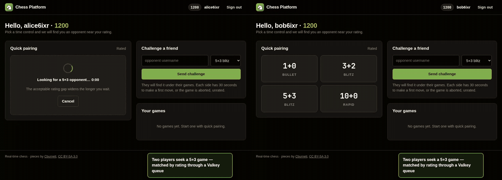
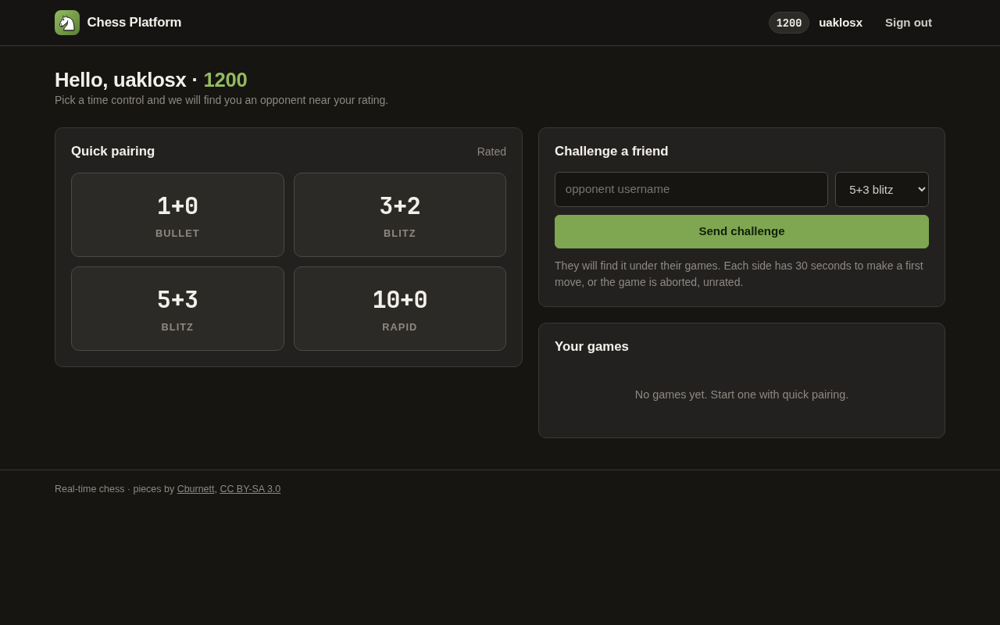
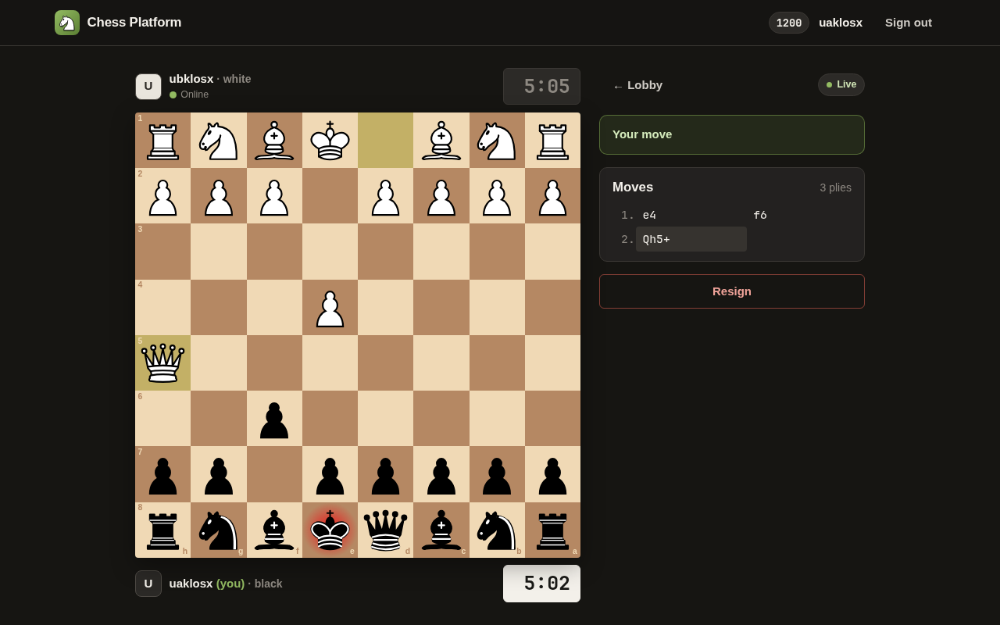
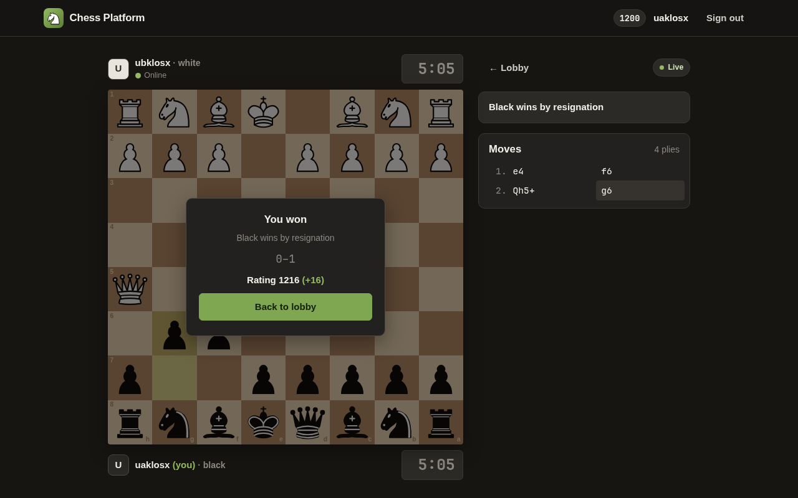
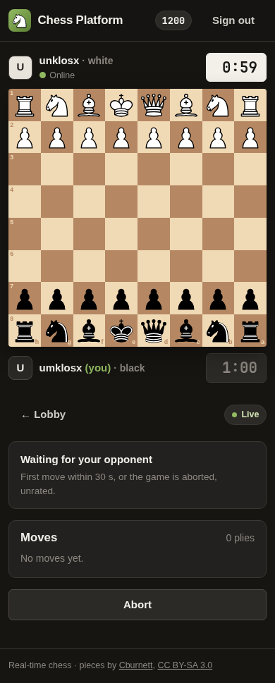
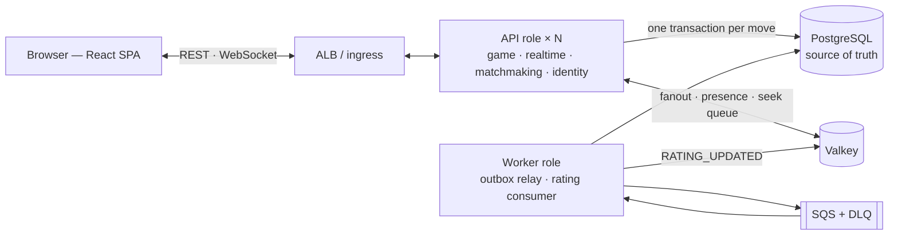

# Chess Platform

A real-time multiplayer chess platform, built as a production-grade backend. Java 25 · Spring
Boot 4 · PostgreSQL · Valkey · WebSockets · SQS · AWS (ECS Fargate, Terraform) · Kubernetes ·
Docker · k6 · OpenTelemetry.

The interesting engineering here is not chess. It is making a turn-based mutation of shared
state correct under concurrency, network failure, pod death and rolling deployment — with a
clock that decides outcomes and therefore cannot be wrong — and then **measuring** whether it
is, rather than asserting it.



**And mid-game, both API pods replaced by a rolling restart** — the browsers reconnect in under half
a second and play on from the same position
([the clip](docs/demo/README.md#2-a-rolling-restart-mid-game), real `kubectl rollout restart`,
waits shown at 4×).

| Lobby | Game (check after Qh5+) | Game over, rating updated |
|---|---|---|
|  |  |  |

<details><summary>On a phone</summary>



</details>

## Measured

Every figure links to the report it comes from, which states the date, the environment and
the method. Live games are verified move-by-move against the server after every run.

| What | Result | Where |
|---|---|---|
| Concurrency invariant | 16 contenders for the same ply, 100 rounds: exactly one winner every time | `PROJECT_STATE.md` §12 |
| Live games at 1,000 WebSocket connections (kind) | 500 games, server p99 6.7 ms, latency flat from 100 to 1,000 sockets | [baseline](docs/perf/baseline.md) |
| Rolling deploy during 40 live games | 40/40 games consistent, 0 abnormal closes, reconnect p99 498 ms | [rolling deploy](docs/perf/2026-10-01-rolling-deploy-kind.md) |
| Stress that crashed both pods | Memory budget sized from measurement: OOM-killed 4× per pod → 0 restarts | [optimisation 01](docs/perf/optimisation-01.md) |
| Sign-up burst on AWS Fargate (0.5 vCPU) | bcrypt starved the virtual-thread carriers: 30/50 games → **50/50**, 265 error lines → 0 | [optimisation 02](docs/perf/optimisation-02.md) |
| PostgreSQL frozen 30 s under 20 live games | 20/20 games consistent; longest wait 33.5 s → **2.9 s**; ERROR lines 127 → 1 | [failure drills](docs/failure-drills.md) |
| Queue or worker down 60 s | Games unaffected; ratings delivered within 3 s / 14 s of recovery | [failure drills](docs/failure-drills.md) |
| Unauthenticated 100 MB request bodies | Heap 58 MB → 2.4 GB (one would end an AWS task) → now 413 at 16 KB | [security review](docs/security-review.md) |

Measured on AWS only to about 100 concurrent sockets — the larger run was stopped on cost. The
1,000-socket figure is from kind on one laptop. Both are stated as such wherever they appear.

## Architecture



A modular monolith — one image, three roles (API, worker, migrate) — with module boundaries
enforced by ArchUnit. More: [diagrams](docs/diagrams/README.md) (a move across two pods, the
asynchronous rating path, the AWS deployment, a rolling deploy) and
[`ARCHITECTURE.md`](ARCHITECTURE.md).

## Decisions worth reading first

- **The clock does not tick.** Remaining time is computed from three persisted columns and
  PostgreSQL's `now()`, so it is identical from any pod, survives reconnection to a different
  instance, and cannot drift. [ADR-006](docs/adr/ADR-006-computed-clock.md)
- **No distributed lock.** Move safety comes from an idempotency key, an optimistic version
  column and a composite primary key — inside one database transaction. A Redis lock would add a
  TTL-expiry failure mode without removing any of those.
  [ADR-005](docs/adr/ADR-005-optimistic-locking-not-distributed-locks.md)
- **PostgreSQL is the only source of truth.** Valkey holds nothing that cannot be rebuilt; it
  can be restarted mid-game. [ADR-004](docs/adr/ADR-004-postgres-source-of-truth.md)
- **Exactly-once effects on at-least-once delivery.** A transactional outbox, SQS Standard, and
  a consumer that records each event in the same transaction as its effect.
  [ADR-008](docs/adr/ADR-008-sqs-not-kafka.md)
- **A pod can leave mid-game.** It drains its sockets with a reconnect hint; the client resumes
  on another pod from a snapshot. [ADR-024](docs/adr/ADR-024-kubernetes-and-graceful-drain.md)

## Run it locally

Requires Docker, a JDK 17+ to run Gradle (it fetches JDK 25 itself) and Node 20+.

```bash
docker compose -f ops/docker/docker-compose.yml up -d          # PostgreSQL, Valkey, ElasticMQ
./gradlew :backend:bootRun --args='--spring.profiles.active=local'
cd frontend && npm install && npm run dev                       # http://localhost:5173
```

Tests: `./gradlew :backend:test` (unit, architecture) and `./gradlew :backend:integrationTest`
(Testcontainers). Kubernetes on kind: `k8s/cluster-up.sh`, then `k8s/deploy.sh <image tag>`.
Details: [`SETUP.md`](SETUP.md), [`DEPLOYMENT.md`](DEPLOYMENT.md).

## Status

**Phases 1–9 complete; Phase 10 (hardening and documentation) in progress.** Gameplay with a
server-authoritative clock, realtime over WebSockets across instances, matchmaking, asynchronous
ratings, rate limiting, CI/CD, AWS deployment (applied for sessions, then destroyed), Kubernetes
on kind, tracing, load testing, a security review and failure drills.
[`PROJECT_STATE.md`](PROJECT_STATE.md) is the authoritative current state.

## Documentation

| File | Contents |
|---|---|
| [`PROJECT_STATE.md`](PROJECT_STATE.md) | **Start here.** Current phase, what's done, known debt, the measurement ledger |
| [`ARCHITECTURE.md`](ARCHITECTURE.md) | Schema, protocol, clock, concurrency, failure matrix, scaling — as built |
| [`docs/diagrams/`](docs/diagrams/README.md) | The system, a move, the rating path, AWS, a rolling deploy |
| [`docs/adr/`](docs/adr/) | Architecture Decision Records — the *why* behind every major choice |
| [`docs/perf/`](docs/perf/README.md) | Load tests: before → bottleneck → change → after |
| [`docs/failure-drills.md`](docs/failure-drills.md) | Dependencies failed on purpose under live games |
| [`docs/security-review.md`](docs/security-review.md) | OWASP API Top 10: findings, fixes, accepted risks |
| [`ROADMAP.md`](ROADMAP.md) | Phases, time budgets, definitions of done |
| [`SETUP.md`](SETUP.md) · [`DEPLOYMENT.md`](DEPLOYMENT.md) | Local development · AWS and Kubernetes, with the destroy checklist |
| [`TROUBLESHOOTING.md`](TROUBLESHOOTING.md) | Problems met, and how they were resolved |
| [`docs/design-qa.md`](docs/design-qa.md) | Design questions the system raises — trade-offs, failures, limits — answered |
| [`DEVELOPMENT_LOG.md`](DEVELOPMENT_LOG.md) | Chronological record of work and decisions |

## A note on numbers

No performance, cost or scale figure appears in this repository without being either (a)
backed by a report in `docs/` stating the date and environment, or (b) labelled an estimate.
The ledger is `PROJECT_STATE.md` §12.
