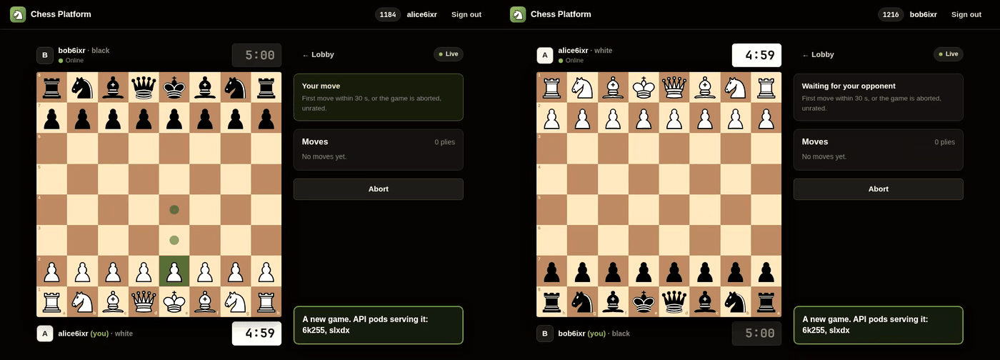

# Demo

Two real browsers, recorded side by side (Phase 10.6) on kind, running `main` with this
milestone's browser fix (below). Nothing
is staged: the moves go through the real server, and the restart is a real
`kubectl rollout restart` of the API deployment. Captions are an overlay drawn by the recording
script, not part of the app.

## 1. Play

`1-play.gif` — 14 s, real speed: seek, pair, checkmate, rating.


Two players seek a 5+3 game and are paired through the Valkey queue; scholar's mate; the rating
change (±16) reaches both browsers asynchronously — outbox → SQS → rating worker → WebSocket.

## 2. A rolling restart mid-game

`2-rolling-restart.gif` — 38 s, waits at 4×.



Mid-game, both API pods are replaced. New pods start while the old ones keep serving; each old pod
then drains — readiness off, every socket closed with 1001 GOING_AWAY — and the browsers reconnect
to a new pod and resume from a snapshot. The game plays on throughout.

**What is sped up:** only the waits — the new pods starting, the second old pod draining, and the
remaining moves — at 4×, with a **4×** badge on screen while it is. The moves around the restart,
the drain and the reconnect play at real speed. Real time: restart → first drain 26.6 s, → both
old pods gone 46.1 s.

**Measured in this take** (in the page, from the connection badge leaving "Live" to "Live" again):
the browsers reconnected in **453 ms and 275 ms**. No page errors; 36 plies, identical on both
boards at the end.

**Found while recording:** a move made in the instant a pod drained was lost with its socket — the
server never applied it, and the player's move silently vanished. The browser now keeps its last
unacknowledged move and re-sends it after the reconnect with the same `clientMoveId`, which the
server's idempotency key makes safe (`frontend/e2e/move-across-reconnect.mjs`).

## Regenerate

```bash
k8s/cluster-up.sh && k8s/deploy.sh <image tag>        # an image of the commit to show
kubectl -n chess delete hpa api && kubectl -n chess scale deploy api --replicas=2
cd frontend && APP_URL=http://localhost npm run demo -- e2e/out/demo   # ~2 min; writes the videos + marks.json
cd .. && docs/demo/make-gif.sh frontend/e2e/out/demo                   # cuts, syncs, speeds the waits, GIFs
```

Needs `ffmpeg` (with libvpx) and Chromium. Playwright records through its own ffmpeg build; where
it cannot be downloaded, a symlink to the system one works (TROUBLESHOOTING). A rolling restart
briefly runs three API JVMs — on a 16 GB laptop with other applications open, the kernel's OOM
killer took the ingress controller during one take; the recording script's checks now catch that
(compare container restarts before and after the take).
