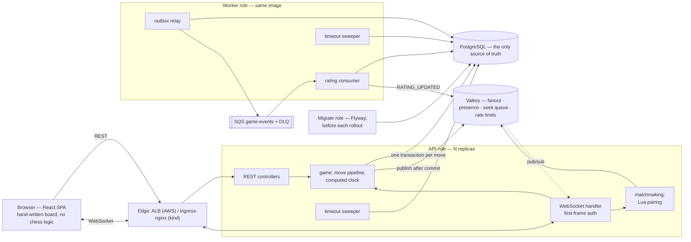
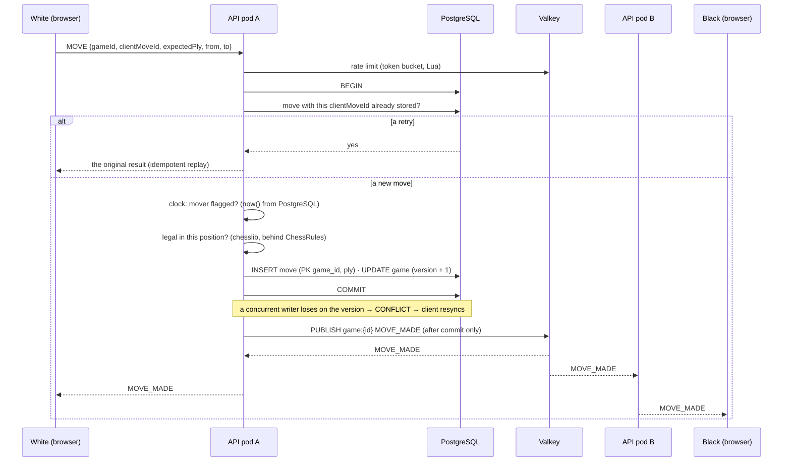
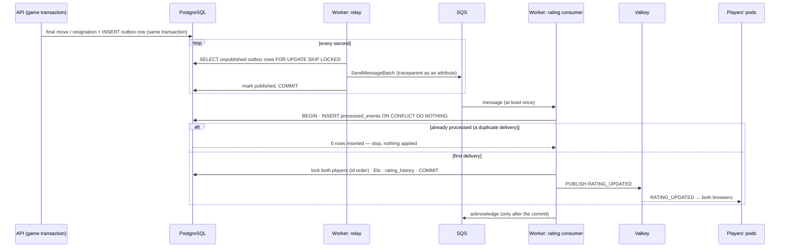
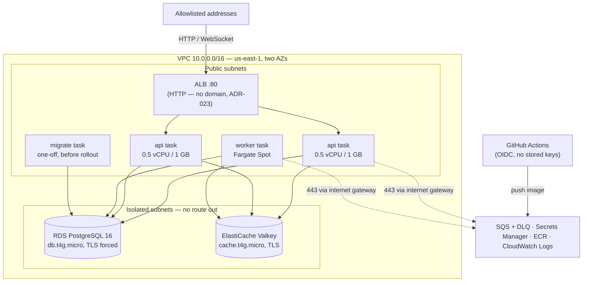
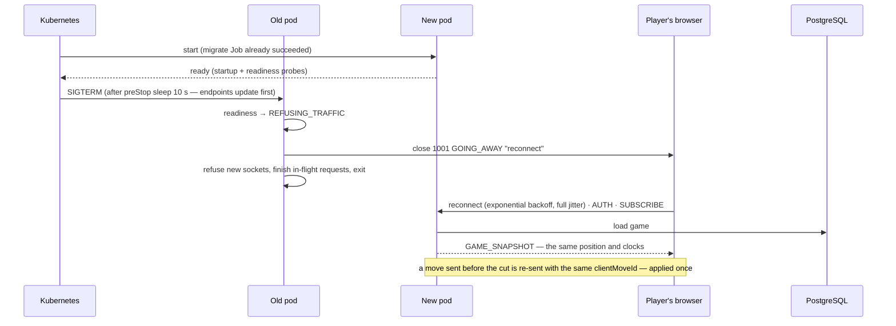

# Diagrams

Mermaid, rendered by GitHub. Each one describes the system **as built**, checked against the
code in Phase 10.3; the section it belongs to in `ARCHITECTURE.md` is named under it.

1. [The system](#1-the-system)
2. [A move, across two pods](#2-a-move-across-two-pods)
3. [A game ends: the rating, asynchronously](#3-a-game-ends-the-rating-asynchronously)
4. [The AWS deployment](#4-the-aws-deployment)
5. [A rolling deploy under live games](#5-a-rolling-deploy-under-live-games)

---

## 1. The system

One image, three roles. PostgreSQL holds everything that matters; Valkey holds only what can be
rebuilt; the queue carries only what may arrive late.

`ARCHITECTURE.md` §3 · ADR-001 (modular monolith), ADR-004 (PostgreSQL the source of truth),
ADR-021 (one image, three roles).

---

## 2. A move, across two pods

The players are usually on different pods. The mover learns the outcome from the same broadcast
as the opponent, never from a private reply — both see identical state.

Three layers make "exactly one move per ply" true without a lock: the idempotency key, the
version column, the primary key. `ARCHITECTURE.md` §5, §7 · ADR-005, ADR-006.

---

## 3. A game ends: the rating, asynchronously

The event is written in the game's own transaction, so a finished game without its event cannot
exist. Delivery is at-least-once; the effect is exactly-once.

Measured: queue or worker down for 60 s → games unaffected, events waited in the outbox, rated
within 3 s / 14 s of recovery (`docs/failure-drills.md`). `ARCHITECTURE.md` §9 · ADR-008,
ADR-020, ADR-026.

---

## 4. The AWS deployment

No NAT gateway: tasks reach AWS APIs over the internet gateway from public subnets, and nothing
reaches them inbound except the load balancer. Applied for sessions, then destroyed.

Security groups reference each other (ALB → api; api, worker → RDS and Valkey). Only the
worker's task role can touch the queue; the API has no AWS permissions. `ARCHITECTURE.md` §12 ·
ADR-010, ADR-023 · `docs/security-review.md`.

---

## 5. A rolling deploy under live games

No game state lives in a pod, so a pod can leave mid-game: it stops taking new sockets, tells
every client to reconnect, and the reconnect lands on a pod that reads the same database.

Measured on kind: 40 live games through a rolling restart — 40/40 consistent, 116 sockets moved
with 1001, 0 abnormal closes, reconnect p99 498 ms (`docs/perf/2026-10-01-rolling-deploy-kind.md`).
`ARCHITECTURE.md` §12.2 · ADR-024.
